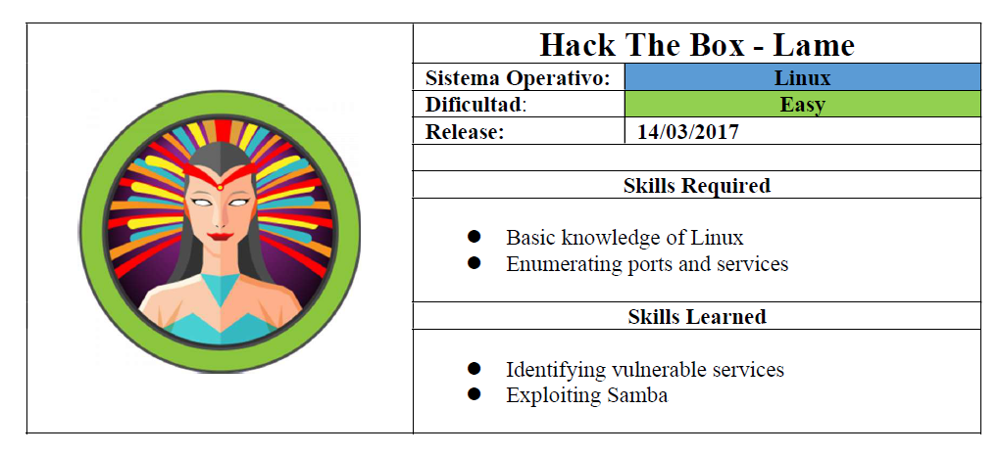
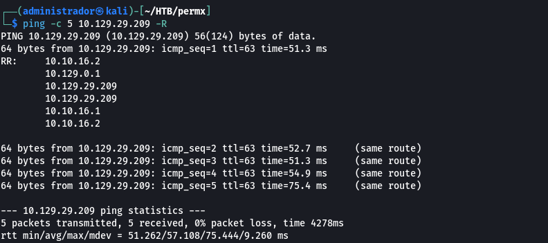
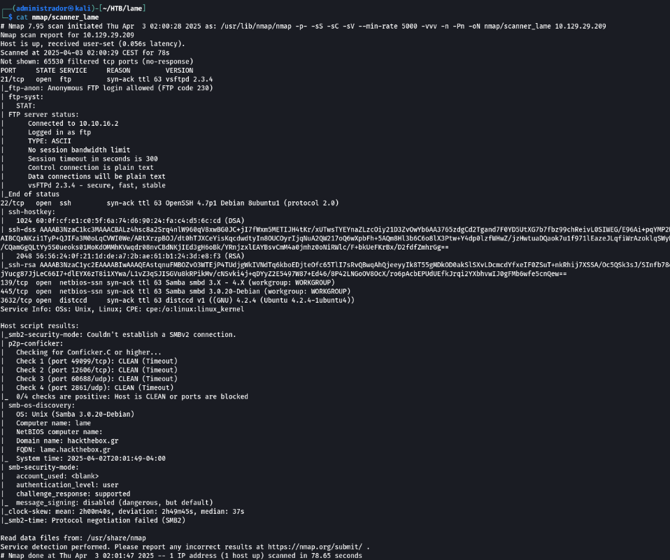
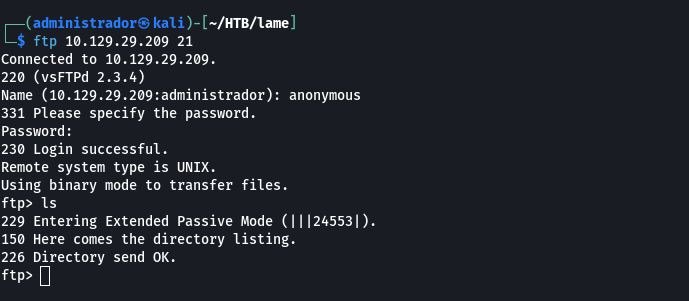
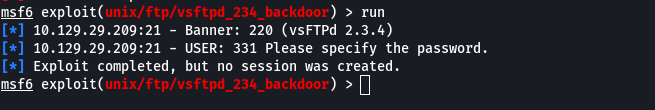
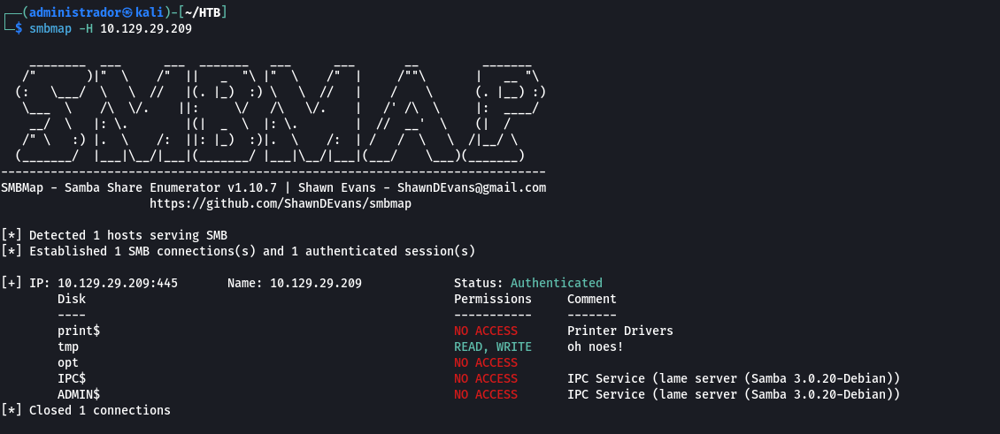
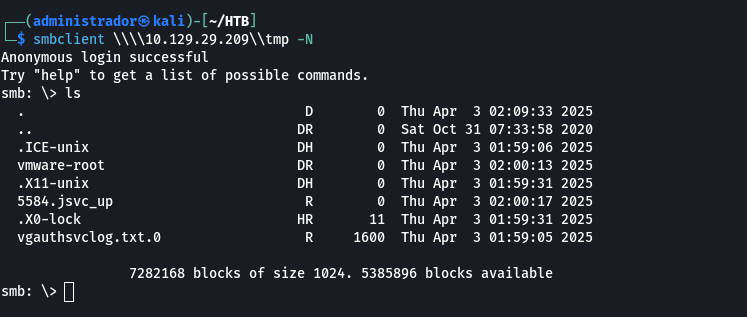
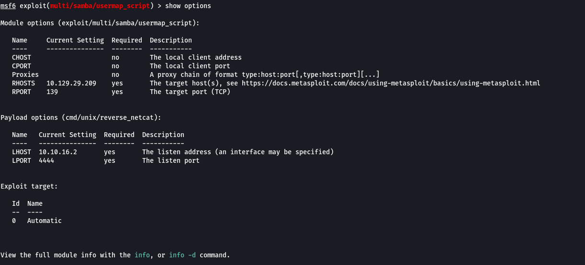
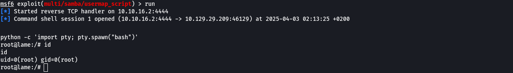

La presente investigación técnica documenta el proceso de identificación, análisis y explotación de diversas superficies de ataque expuestas por un sistema remoto que presentaba un conjunto significativo de vulnerabilidades de alto impacto. El objetivo central consistió en evaluar la resiliencia del entorno frente a técnicas ofensivas avanzadas, determinando la capacidad del adversario para obtener acceso no autorizado, ejecutar código arbitrario y comprometer la integridad operativa del host. 

Durante la fase de inspección preliminar se evidenció la exposición de servicios críticos, entre ellos FTP y SMB, cuyas versiones específicas presentaban vulnerabilidades ampliamente documentadas y susceptibles de explotación remota sin autenticación previa. La correlación de estos hallazgos permitió establecer una cadena de ataque coherente, fundamentada en debilidades de sanitización de entradas, fallos en la neutralización de metacaracteres y la presencia de puertas traseras introducidas de manera maliciosa en componentes de software comprometidos durante su distribución. 

La explotación de dichas vulnerabilidades posibilitó la obtención de acceso privilegiado al sistema, demostrando la viabilidad de un compromiso total del entorno y evidenciando la necesidad de adoptar medidas de mitigación urgentes para reforzar la postura de seguridad.

<strong><u>Enumeración</u></strong>

La dirección IP de la máquina víctima es 10.129.29.209. Por tanto, envié 5 trazas ICMP para verificar que existe conectividad entre las dos máquinas.

Una vez que identificada la dirección IP de la máquina objetivo, utilicé el comando nmap -p- -sS -sC -sV --min-rate 5000 -vvv -n -Pn 10.129.29.209 -oN scanner_lame para descubrir los puertos abiertos y sus versiones:

- (-p-): realiza un escaneo de todos los puertos abiertos.
- (-sS): utilizado para realizar un escaneo TCP SYN, siendo este tipo de escaneo el más común y rápido, además de ser relativamente sigiloso ya que no llega a completar las conexiones TCP. Habitualmente se conoce esta técnica como sondeo de medio abierto (half open). Este sondeo consiste en enviar un paquete SYN, si recibe un paquete SYN/ACK indica que el puerto está abierto, en caso contrario, si recibe un paquete RST (reset), indica que el puerto está cerrado y si no recibe respuesta, se marca como filtrado.
- (-sC): utiliza los scripts por defecto para descubrir información adicional y posibles vulnerabilidades. Esta opción es equivalente a --script=default. Es necesario tener en cuenta que algunos de estos scripts se consideran intrusivos ya que podría ser detectado por sistemas de detección de intrusiones, por lo que no se deben ejecutar en una red sin permiso.
- (-sV): Activa la detección de versiones. Esto es muy útil para identificar posibles vectores de ataque si la versión de algún servicio disponible es vulnerable. 
- (--min-rate 5000): ajusta la velocidad de envío a 5000 paquetes por segundo.
- (-Pn): asume que la máquina a analizar está activa y omite la fase de descubrimiento de hosts.

<strong><u>Análisis del puerto 21 (FTP)</u>p><strong><u>

El análisis preliminar de superficie evidenció la exposición del puerto 21/tcp, correspondiente al protocolo FTP, sobre el cual se encontraba operativo el servicio vsftpd en su versión 2.3.4. Esta iteración concreta del software es ampliamente conocida por incorporar una vulnerabilidad crítica, registrada como CVE 2011 2523, cuya explotación compromete de manera severa la integridad, la confidencialidad y la disponibilidad del sistema afectado. 

La debilidad no responde a un defecto inherente al diseño original del servicio, sino a una manipulación maliciosa del código fuente introducida durante su distribución oficial entre el 30 de junio y el 3 de julio de 2011. Dicha manipulación consistió en la inserción encubierta de una puerta trasera destinada a habilitar la activación de una shell arbitraria en el puerto 6200/tcp, proporcionando al atacante un canal de ejecución remota de comandos con privilegios irrestrictos y, en consecuencia, la capacidad de asumir control pleno sobre el host comprometido.

Desde una perspectiva estrictamente técnica, el comportamiento observable se deriva de una neutralización defectuosa de caracteres especiales en las cadenas de entrada procesadas por el servicio, lo que desemboca en una condición de inyección de comandos tipificada bajo el estándar CWE 78: Improper Neutralization of Special Elements used in an OS Command. La explotación es factible de manera remota y sin necesidad de autenticación previa, circunstancia que eleva su criticidad a niveles máximos según los vectores de puntuación CVSS v3.1 (9.8) y CVSS v2.0 (10.0), ambos indicadores de riesgo extremo y de potencial impacto sistémico.

Aunque el framework Metasploit dispone de un módulo específicamente diseñado para la explotación automatizada de esta vulnerabilidad, la ejecución inicial del exploit únicamente produjo el establecimiento de una sesión sin materializar los efectos esperados. Este comportamiento anómalo obligó a reexaminar el enfoque ofensivo adoptado, replanteando la estrategia de intrusión y abriendo la vía a la exploración de vectores alternativos que permitieran obtener un acceso efectivo y verificable al entorno objetivo.

 

<strong><u>Análisis del puerto 445 (SMB)</u>p><strong><u>

El análisis del perímetro de exposición del sistema reveló la presencia del puerto 445/tcp, asociado al protocolo Server Message Block (SMB), un mecanismo de comunicación de naturaleza transaccional diseñado para facilitar el intercambio de archivos, impresoras y otros recursos compartidos en entornos corporativos, particularmente aquellos basados en sistemas operativos de la familia Microsoft Windows. Al operar en la capa de aplicación del modelo TCP/IP, SMB habilita la interacción entre clientes y servidores mediante sesiones que permiten acceder a elementos compartidos alojados en nodos remotos. 

 

En este caso, la disponibilidad del servicio permitió iniciar un proceso de enumeración exhaustiva de los recursos expuestos, aprovechando la posibilidad de establecer sesiones con el usuario guest, tradicionalmente vinculado a accesos no autenticados.

Para llevar a cabo dicha enumeración con el rigor metodológico requerido, se empleó smbmap, una herramienta escrita en Python que se ha consolidado como estándar de facto en tareas de reconocimiento pasivo sobre infraestructuras SMB. Su arquitectura integra capacidades avanzadas para el análisis de permisos, la inspección de jerarquías de directorios y la identificación de configuraciones de acceso potencialmente anómalas. 

Gracias a su enfoque sistemático, smbmap proporciona una visión estructurada y de alta resolución sobre los recursos compartidos, permitiendo detectar desajustes en privilegios, exposiciones indebidas y vectores susceptibles de facilitar movimientos laterales o escaladas de acceso.

  

Complementariamente, se utilizó smbclient, componente de la suite Samba que opera de manera análoga a un cliente FTP, permitiendo listar directorios, navegar por las unidades compartidas y transferir archivos mediante una interfaz de línea de comandos robusta y ampliamente adoptada en auditorías de seguridad. A pesar de la exhaustividad del proceso de inspección, el contenido accesible no reveló información operativamente relevante ni configuraciones que pudieran ser aprovechadas para profundizar en la intrusión o desencadenar un compromiso adicional del entorno.

  

La investigación posterior permitió identificar que el sistema objetivo ejecutaba Samba 3.0.2, versión afectada por la vulnerabilidad CVE 2007 2447, un fallo crítico que compromete la funcionalidad MS RPC del servicio smbd en versiones comprendidas entre la 3.0.0 y la 3.0.25rc3. El defecto se origina en una sanitización insuficiente de metacaracteres del shell en la función SamrChangePassword, cuando la opción username map script se encuentra habilitada en el archivo de configuración smb.conf. Esta condición habilita la inyección de comandos arbitrarios a través de dichos metacaracteres, permitiendo a un atacante remoto ejecutar instrucciones con privilegios elevados y comprometer de forma directa la integridad del sistema.

La vulnerabilidad no se limita exclusivamente al flujo de cambio de credenciales, sino que se extiende a otros servicios MS RPC relacionados con la administración de impresoras remotas y la gestión de recursos compartidos, ampliando el espectro de superficies explotables y facilitando la ejecución de comandos privilegiados por parte de usuarios autenticados. 

   

En un escenario operativo real, la explotación correctamente orquestada de esta debilidad permite obtener acceso privilegiado al sistema, consolidando un punto de control total sobre el host comprometido y habilitando fases posteriores de persistencia, exfiltración o escalada en la cadena de ataque.

